# Diagramas de sequência

Cada fluxo que produz efeito no projeto, do clique até o arquivo em disco. Os nomes de rota, classe e evento são os do código: `server/api`, `server/routes`, `core/use-cases`, `core/modules` e `core/webdriver`.

Os casos de uso vistos por ator estão em [USE-CASE-DIAGRAMS](USE-CASE-DIAGRAMS.md).

## Sumário

| # | Fluxo | Entrada | O que fica no projeto |
|---|-------|---------|----------------------|
| 1 | [Subir o acutis](#1-subir-o-acutis) | `npx @acutis/cli` | Nada, o processo sobe numa porta livre |
| 2 | [Criar projeto local](#2-criar-projeto-local) | `POST /api/projects` | Pasta com template, `acutis.json`, `.gitignore` |
| 3 | [Clonar projeto de um repositório](#3-clonar-projeto-de-um-repositório) | `POST /api/projects/probe`, `POST /api/projects/clone` | Repositório clonado, `acutis.json` |
| 4 | [Listar, buscar e abrir projetos](#4-listar-buscar-e-abrir-projetos) | `GET /api/projects`, `GET /api/projects/{slug}` | Nada, é leitura |
| 5 | [Renomear e apagar o projeto](#5-renomear-e-apagar-o-projeto) | `PUT /api/projects/{slug}`, `DELETE /api/projects/{slug}` | Pasta renomeada ou removida |
| 6 | [Configurar a IA](#6-configurar-a-ia) | `POST /api/settings/ai/models`, `/ping`, `PUT /api/settings/ai` | Nada no projeto, o cadastro é do acutis |
| 7 | [Definir a URL base](#7-definir-a-url-base) | `PUT /api/projects/{slug}/settings`, `POST .../settings/skip` | `environments/*.json`, `.env`, `.env.example` |
| 8 | [Criar, editar e ativar ambientes](#8-criar-editar-e-ativar-ambientes) | `/api/projects/{slug}/environments` | `environments/*.json`, `.env` |
| 9 | [Gravar a autenticação](#9-gravar-a-autenticação) | WebSocket + `POST /api/projects/{slug}/auth/record` | `tests/auth.setup.ts`, `storage-state.json` |
| 10 | [Editar, executar e dispensar a autenticação](#10-editar-executar-e-dispensar-a-autenticação) | `PUT /api/projects/{slug}/auth`, `POST .../auth/skip` | `tests/auth.setup.ts` ou `acutis.json` |
| 11 | [Guardar as credenciais do login](#11-guardar-as-credenciais-do-login) | `POST /api/projects/{slug}/auth/credentials` | `environments/*.json`, `.env` |
| 12 | [Gravar um cenário](#12-gravar-um-cenário) | WebSocket `START_RECORDING` | Nada ainda, a gravação vive na tela |
| 13 | [Rascunhar e salvar o cenário](#13-rascunhar-e-salvar-o-cenário) | `POST /tests/draft` + `POST /tests` | `tests/<domínio>/<nome>.spec.ts`, `.feature`, `.events.json` |
| 14 | [Retomar a gravação de um passo](#14-retomar-a-gravação-de-um-passo) | `START_RECORDING` com `replay` | Spec e gravação substituídos |
| 15 | [Executar um cenário](#15-executar-um-cenário) | `GET /api/projects/{slug}/run-stream` | `runs/<id>/history.ndjson`, vídeo, `results/` |
| 16 | [Executar os cenários filtrados](#16-executar-os-cenários-filtrados) | `run-stream` com `grep` | Um histórico por cenário, mais a rodada em `runs/_suite` |
| 17 | [Ver o histórico e o vídeo de um cenário](#17-ver-o-histórico-e-o-vídeo-de-um-cenário) | `GET /api/projects/{slug}/scenarios/{...}` | Nada, é leitura |
| 18 | [Ver o relatório do projeto](#18-ver-o-relatório-do-projeto) | `GET /api/projects/{slug}/runs` | Nada, é leitura |
| 19 | [Abrir uma rodada do relatório](#19-abrir-uma-rodada-do-relatório) | `GET /api/projects/{slug}/runs` | Nada, é leitura |
| 20 | [Abrir o relatório do Playwright](#20-abrir-o-relatório-do-playwright) | `GET /api/projects/{slug}/report/{...}` | Nada, é leitura |
| 21 | [Editar ou mover um cenário](#21-editar-ou-mover-um-cenário) | `PATCH /api/projects/{slug}/scenarios/{...}` | Arquivos reescritos ou renomeados |
| 22 | [Pausar e voltar a rodar](#22-pausar-e-voltar-a-rodar) | `PATCH /api/projects/{slug}/scenario-skip` | `test.describe.skip` no spec |
| 23 | [Excluir um cenário](#23-excluir-um-cenário) | `DELETE /api/projects/{slug}/scenarios/{...}` | Spec, feature e gravação removidos |
| 24 | [Corrigir o cenário com IA](#24-corrigir-o-cenário-com-ia) | `POST /api/projects/{slug}/scenario-fix` | Spec reescrito, se a proposta for aceita |
| 25 | [Sugerir data-testid](#25-sugerir-data-testid) | `POST /api/projects/{slug}/scenario-suggestions` | Nada, a sugestão é para o sistema testado |
| 26 | [Sincronizar com o repositório](#26-sincronizar-com-o-repositório) | `POST /api/projects/{slug}/git/sync` | Commits do time trazidos, os locais enviados |
| 27 | [O commit que toda ação faz](#27-o-commit-que-toda-ação-faz) | qualquer uma das anteriores | Commit e push no repositório do projeto |
| 28 | [Enviar os logs de um erro](#28-enviar-os-logs-de-um-erro) | `POST /api/telemetry/report` | Nada, o relato sai da máquina |

## 1. Subir o acutis

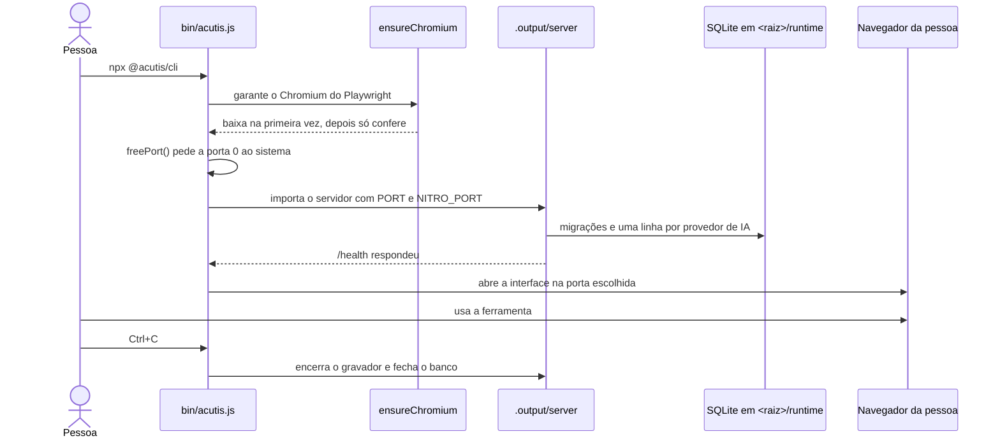

Um processo só: interface, API, WebSocket, gravador e runner. A porta nunca é fixa, é a que o sistema operacional disse estar livre.

## 2. Criar projeto local

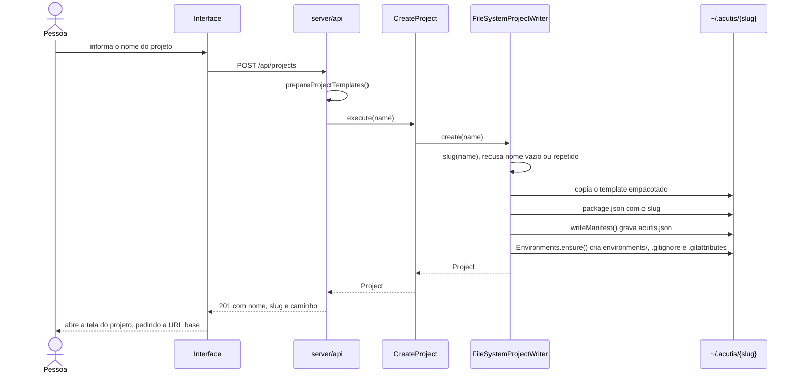

O projeto nasce sem git. Quem quiser versionar roda `git init` na pasta, e a partir daí o acutis passa a commitar sozinho, como no fluxo 27.

## 3. Clonar projeto de um repositório

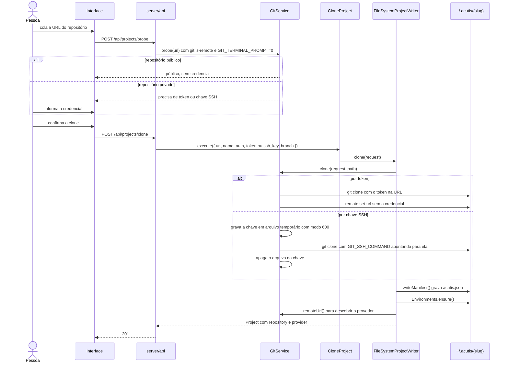

O `set-url` depois do clone é deliberado: a credencial serve à operação e não fica escrita no `.git/config`.

## 4. Listar, buscar e abrir projetos

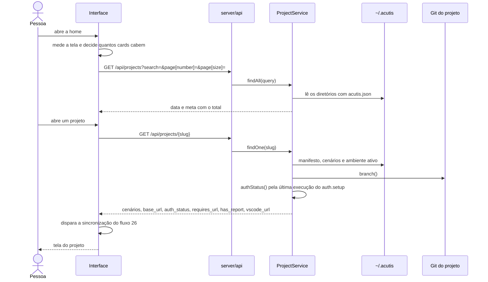

A busca filtra por nome, e a paginação é medida na tela: a quantidade de cards por página vem da altura livre do navegador, não de um número fixo.

## 5. Renomear e apagar o projeto

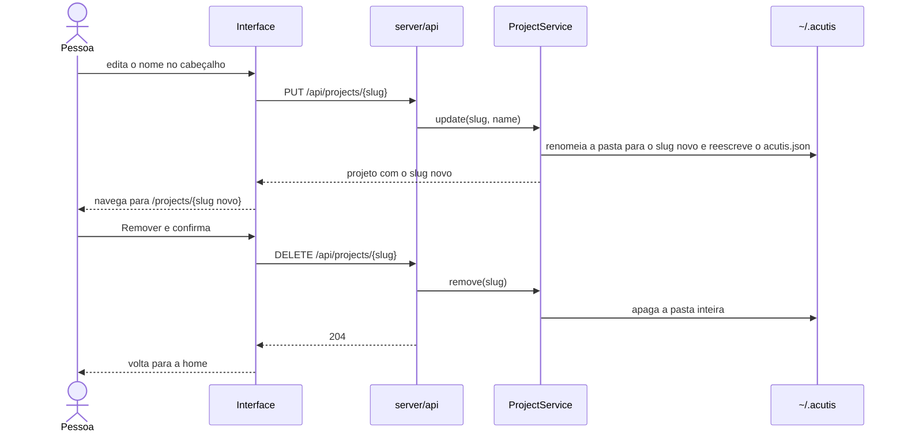

Apagar é local: o repositório remoto continua onde está, e clonar de novo traz os testes de volta.

## 6. Configurar a IA

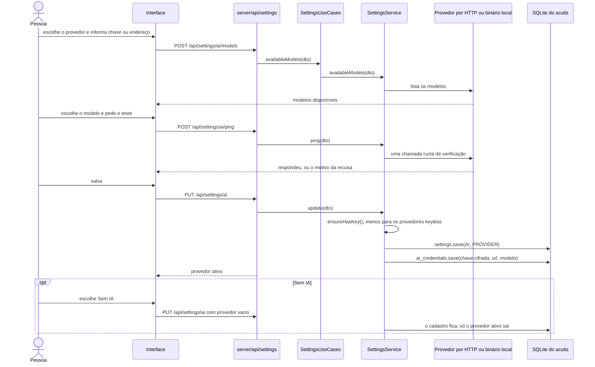

A chave vai cifrada em AES-256-GCM, e a chave de cifra mora em `<raiz>/runtime/app-key`, fora do banco. Anthropic, OpenAI, Gemini, OpenRouter e Ollama falam HTTP; Claude Agent e Codex rodam o binário já autenticado na máquina, então não têm endereço nem chave para cadastrar. Sem provedor ativo, `providers/disabled.ts` responde no lugar do modelo e só as ações da coluna com IA em [USE-CASE-DIAGRAMS](USE-CASE-DIAGRAMS.md#13-quando-a-ia-entra) ficam indisponíveis.

## 7. Definir a URL base

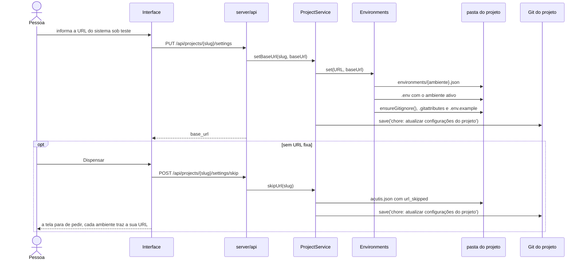

O modal de configurações abre sozinho no projeto que ainda não tem URL base e não a dispensou.

## 8. Criar, editar e ativar ambientes

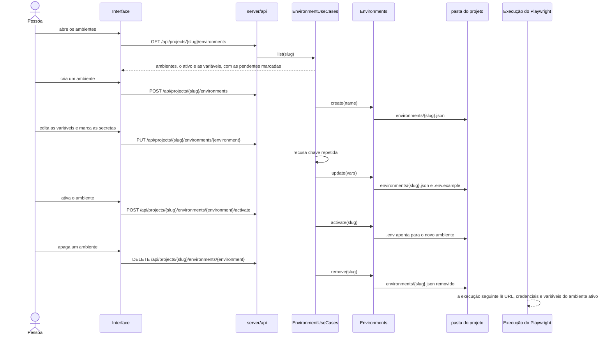

Os valores ficam fora do git: `.env` e `environments/` estão no `.gitignore`, porque cada máquina tem os seus e alguns são segredo. O que se versiona é o `.env.example`, com as chaves. Variável declarada por um cenário e sem valor no ambiente ativo aparece como pendente na tela do projeto, antes de derrubar uma execução.

## 9. Gravar a autenticação

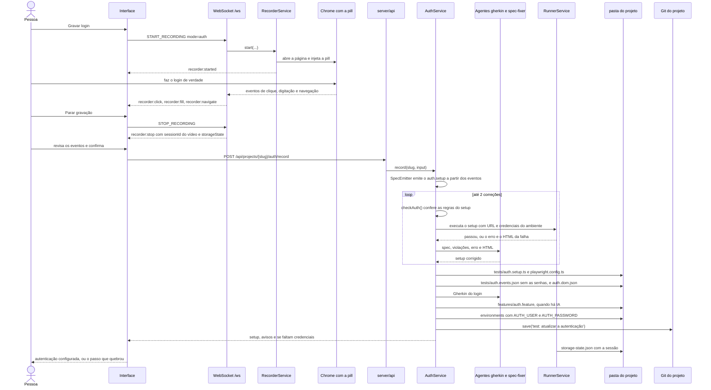

A senha nunca entra no spec: ela vira variável do ambiente ativo, e o `auth.events.json` é gravado sem os valores sensíveis. O `storage-state.json` fica no `.gitignore`, porque é sessão e não fonte. Sem IA, o laço de correção não roda: o setup sai dos eventos e os avisos das regras vão para a tela como estão. Execução que passa sem gravar sessão nenhuma também vira aviso, porque sem ela todo cenário autenticado rodaria deslogado.

## 10. Editar, executar e dispensar a autenticação

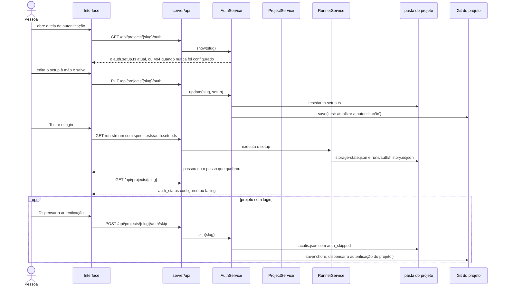

O estado da autenticação não é um campo que alguém marca: `configured` e `failing` saem da última execução do `auth.setup.ts` guardada em `runs/auth/history.ndjson`.

## 11. Guardar as credenciais do login

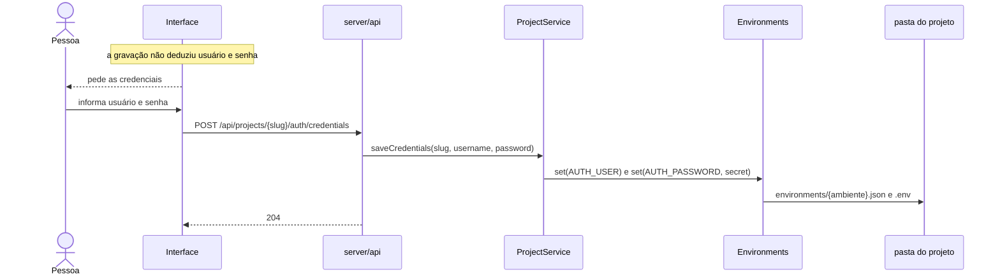

A senha é marcada como segredo, o que muda a máscara na tela e não onde ela é guardada: os dois ficam no ambiente ativo, fora do git.

## 12. Gravar um cenário

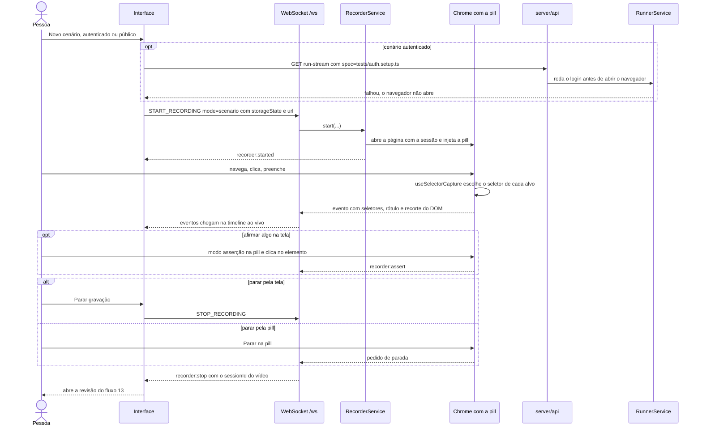

Cenário público é gravado sem sessão e sai marcado `@publico`, o que permite testar a tela de login, o cadastro e a landing. Nada foi para o disco até aqui: a gravação vive na tela.

## 13. Rascunhar e salvar o cenário

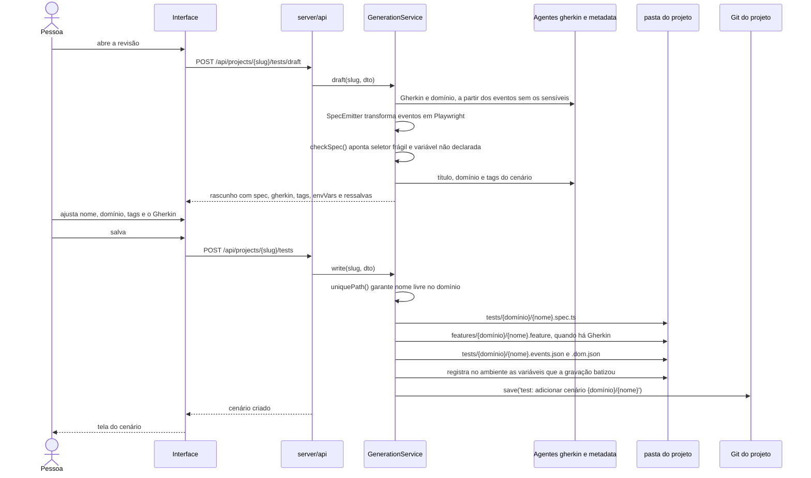

O rascunho é um passo separado de propósito: o spec chega à tela antes de existir arquivo, e é ali que se corrige o que a IA batizou. Sem IA, o rascunho vem sem Gherkin e sem metadado, e o resto do fluxo é o mesmo.

## 14. Retomar a gravação de um passo

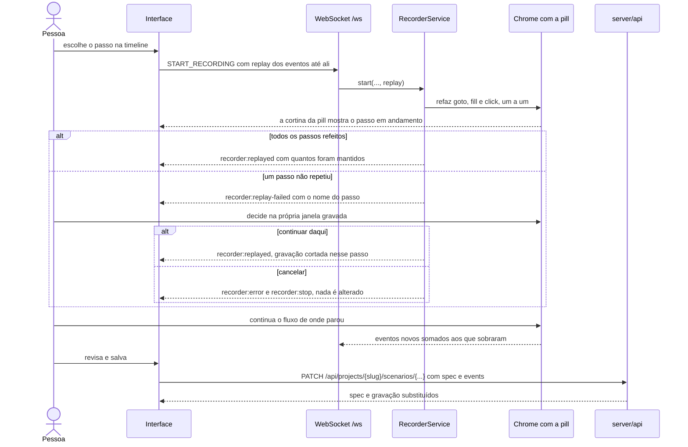

Retomar mantém o tipo da gravação: quem começou autenticado continua autenticado, e quem era público segue público.

## 15. Executar um cenário

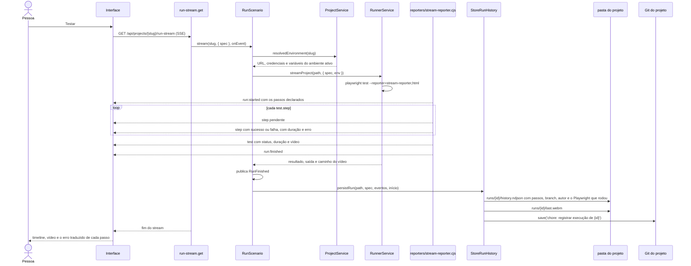

Passo vermelho traz a mensagem do Playwright já traduzida pela tela (`app/utils/run-failure.ts`), com a mensagem original disponível ao lado. Cenário pausado não entra: o Playwright reporta `skipped` sem executar. O `run:finished` é o último evento a sair, mesmo quando chega antes: a tela precisa dos passos completos antes de encerrar.

## 16. Executar os cenários filtrados

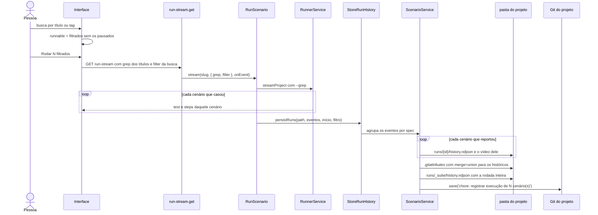

A rodada guarda o filtro que a originou, a branch, o autor, os totais e o resultado de cada cenário. São as últimas 50 que o relatório do projeto lê. O `merge=union` no `.gitattributes` é o que permite duas máquinas gravarem histórico sem conflitar.

## 17. Ver o histórico e o vídeo de um cenário

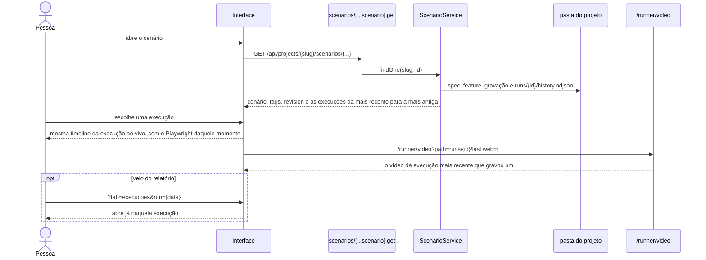

O histórico é por cenário e guarda tanto a execução avulsa quanto a que veio de uma rodada. O vídeo é só o da última execução que gravou um, porque `last.webm` é sobrescrito a cada rodada.

## 18. Ver o relatório do projeto

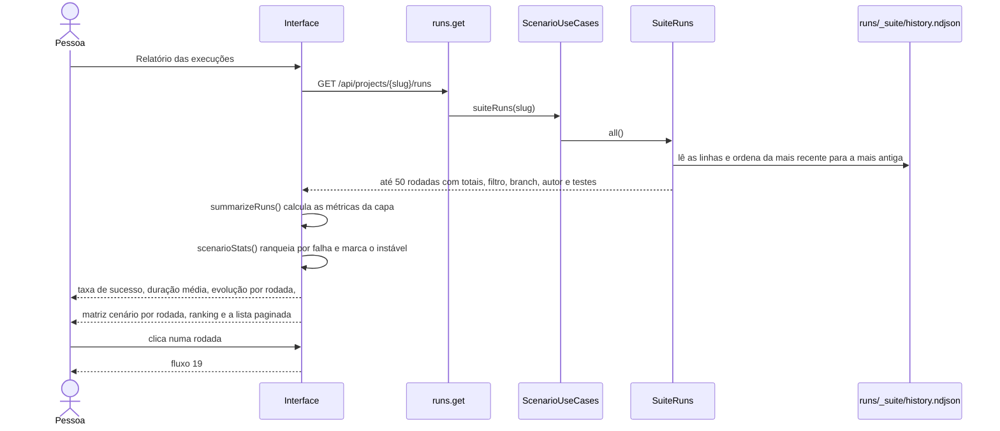

Cenário instável é o que alternou entre verde e vermelho na sequência de rodadas, sem ninguém mexer nele. As últimas 30 rodadas são as que os gráficos desenham; a lista pagina de dez em dez.

## 19. Abrir uma rodada do relatório

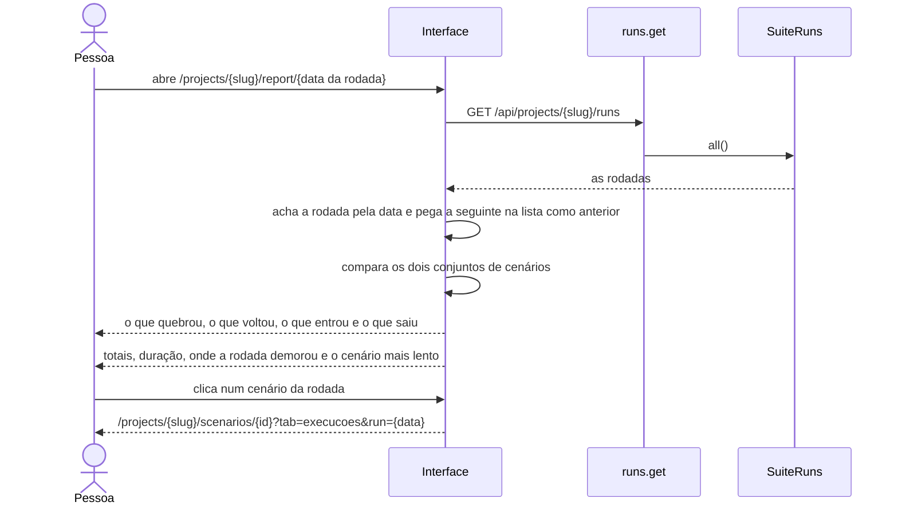

A rodada anterior é a seguinte na lista, porque a lista vem da mais recente para a mais antiga. É a comparação com ela que responde se a rodada melhorou ou piorou.

## 20. Abrir o relatório do Playwright

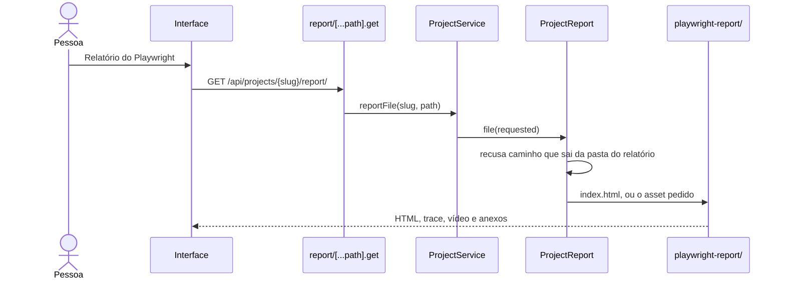

O relatório HTML é gerado pela execução daquela máquina e fica no `.gitignore`, então o botão só aparece quando ele existe. É para onde se vai quando o assunto é trace e anexo; as métricas do time estão no fluxo 18.

## 21. Editar ou mover um cenário

```mermaid
sequenceDiagram
  actor Pessoa
  participant App as Interface
  participant API as scenarios/[...scenario].patch
  participant SS as ScenarioService
  participant FS as pasta do projeto
  participant Git as Git do projeto

  Pessoa->>App: muda título, caminho, domínio, tags ou o Gherkin
  App->>API: PATCH /api/projects/{slug}/scenarios/{...} com a revision aberta
  API->>SS: update(slug, id, dto)
  alt a revision não bate
    SS-->>App: 409, o cenário mudou no repositório
    App-->>Pessoa: rascunho preservado, recarregue e revise
  else segue
    SS->>SS: recusa nome que já existe no domínio
    SS->>SS: stampPlaywrightTitle e stampPlaywrightTags, preservando o skip
    SS->>FS: escreve o spec e o .feature no caminho novo
    opt o caminho mudou
      SS->>FS: apaga spec e feature antigos
      SS->>FS: renomeia .events.json e .dom.json
    end
    opt a revisão trouxe events
      SS->>FS: substitui a gravação, mascarando os sensíveis
    end
    SS->>Git: save('test: atualizar cenário {novo id}')
    API-->>App: cenário atualizado
  end
```

A `revision` é o que impede sobrescrever em silêncio o que outra pessoa subiu enquanto a tela estava aberta.

## 22. Pausar e voltar a rodar

```mermaid
sequenceDiagram
  actor Pessoa
  participant App as Interface
  participant API as scenario-skip.patch
  participant SS as ScenarioService
  participant FS as pasta do projeto
  participant Git as Git do projeto
  participant PW as Playwright

  Pessoa->>App: Pausar
  App->>API: PATCH /api/projects/{slug}/scenario-skip
  API->>SS: skip(slug, id, true)
  SS->>FS: test.describe vira test.describe.skip no spec
  SS->>Git: save('test: pular cenário {id}')
  API-->>App: skipped true
  App-->>Pessoa: selo Pausado no cabeçalho e no card, Testar desabilitado

  Note over PW: qualquer execução, dentro ou fora do acutis, reporta skipped

  Pessoa->>App: Voltar a rodar
  App->>API: PATCH scenario-skip com skipped false
  SS->>FS: test.describe.skip volta a test.describe
  SS->>Git: save('test: voltar a rodar cenário {id}')
```

O cenário pausado continua na listagem e fora da execução dos filtrados: quem monta o `--grep` já tira os pausados.

## 23. Excluir um cenário

```mermaid
sequenceDiagram
  actor Pessoa
  participant App as Interface
  participant API as scenarios/[...scenario].delete
  participant SS as ScenarioService
  participant FS as pasta do projeto
  participant Git as Git do projeto

  Pessoa->>App: Excluir e confirma
  App->>API: DELETE /api/projects/{slug}/scenarios/{...}
  API->>SS: remove(slug, id)
  SS->>FS: apaga o spec, o .events.json, o .dom.json e o .feature
  SS->>Git: save('test: remover cenário {id}')
  API-->>App: 204
  App-->>Pessoa: volta para a listagem do projeto
```

O histórico em `runs/{id}` fica: ele é registro do que aconteceu, e apagar o cenário não desfaz as execuções que existiram.

## 24. Corrigir o cenário com IA

```mermaid
sequenceDiagram
  actor Pessoa
  participant App as Interface
  participant API as scenario-fix.post
  participant AI as ScenarioAiService
  participant IA as Agente spec-fixer
  participant SS as ScenarioService
  participant FS as pasta do projeto
  participant Git as Git do projeto

  Pessoa->>App: Corrigir, no passo que falhou
  App->>API: POST /api/projects/{slug}/scenario-fix
  API->>AI: fix(slug, scenarioId)
  AI->>AI: checkSpec() contra a URL e as variáveis do ambiente ativo
  AI->>IA: spec atual, violações e a gravação
  IA-->>App: spec proposto e resumo do que mudou
  Pessoa->>App: compara e decide
  alt aceita
    App->>API: PATCH scenarios/{...} com o spec proposto e a revision
    API->>SS: update(...)
    SS->>FS: spec reescrito
    SS->>Git: save('test: atualizar cenário {id}')
  else descarta
    App-->>Pessoa: nada é alterado
  end
```

Sem provedor de IA cadastrado o botão Corrigir fica desabilitado, com a explicação no tooltip.

## 25. Sugerir data-testid

```mermaid
sequenceDiagram
  actor Pessoa
  participant App as Interface
  participant API as scenario-suggestions.post
  participant AI as ScenarioAiService
  participant IA as Agente selector
  participant SR as selector-rules

  Pessoa->>App: Ver sugestões
  App->>API: POST /api/projects/{slug}/scenario-suggestions
  API->>AI: suggestions(slug, scenarioId)
  AI->>AI: fragileTargets() separa os alvos com seletor frágil
  AI->>IA: propõe um data-testid por alvo
  IA-->>AI: sugestões em kebab-case, endereçadas pelo índice do alvo
  AI->>SR: valida recurso-acao e kebab-case
  AI-->>App: sugestões com o seletor atual ao lado
  App-->>Pessoa: o que pedir para o time do sistema testado
```

Este é o único fluxo que não escreve nada: a mudança precisa acontecer no sistema sob teste, não no projeto de testes.

## 26. Sincronizar com o repositório

```mermaid
sequenceDiagram
  actor Pessoa
  participant App as Interface
  participant API as git/sync.post
  participant PS as ProjectService
  participant G as Git (core/modules/git/providers/git.ts)
  participant Remote as origin

  Note over App: ao abrir a tela e depois de cada ação que escreve
  App->>API: POST /api/projects/{slug}/git/sync
  API->>PS: sync(slug)
  PS->>G: sync()
  G->>G: fila por repositório, uma operação de cada vez
  alt sem remote
    G-->>App: synced, o projeto é só local
  else
    G->>Remote: fetch origin
    alt a rede ou a credencial falhou
      G-->>App: unavailable com o motivo
      App-->>Pessoa: marca no atalho do VS Code, o trabalho continua
    else
      G->>G: ensureUpstream() e rebase no que veio
      alt conflito
        G->>G: rebase --abort
        G-->>App: conflict
        App-->>Pessoa: resolva no console do git, dentro do VS Code
      else
        G->>Remote: push origin HEAD
        G-->>App: synced com changed, se o HEAD mudou
        App->>App: recarrega a tela quando algo mudou
      end
    end
  end
```

A sincronização não interrompe nada: conflito e indisponibilidade viram marca na tela, e a próxima ação tenta de novo. Indisponibilidade nunca apaga um conflito já conhecido, porque não ter resposta do remoto não prova que alguém resolveu.

## 27. O commit que toda ação faz

```mermaid
sequenceDiagram
  participant S as Service da ação
  participant G as Git (core/modules/git/providers/git.ts)
  participant Repo as .git do projeto
  participant Remote as origin

  S->>G: save(mensagem, arquivos que a ação escreveu)
  G->>G: isRepository()? projeto sem git segue em frente
  loop cada arquivo
    G->>Repo: git add <arquivo>
    Note over G,Repo: caminho que não existe é ignorado, sem derrubar os outros
  end
  alt algo foi para o índice
    G->>Repo: git commit -m mensagem
    opt o git não sabe quem assina
      G->>Repo: user.name Acutis e user.email acutis@local, só neste repositório
      G->>Repo: git commit de novo
    end
    G->>Remote: git push origin HEAD --set-upstream
    opt o remote andou
      G->>Remote: fetch, rebase e push de novo
      Note over G,Remote: conflito de verdade para aqui, o commit fica local
    end
  else nada mudou
    G-->>S: sem commit
  end
```

Um `add` por arquivo é o que garante o commit: com uma lista só, um caminho inexistente (o `.dom.json` que a gravação não capturou) fazia o git recusar tudo, e a ação inteira ficava pendente.

O prefixo separa o que é teste do que é infraestrutura do projeto:

| Ação | Mensagem |
|------|----------|
| Criar cenário | `test: adicionar cenário <domínio>/<nome>` |
| Editar ou mover cenário | `test: atualizar cenário <id>` |
| Pausar cenário | `test: pular cenário <id>` |
| Voltar a rodar | `test: voltar a rodar cenário <id>` |
| Excluir cenário | `test: remover cenário <id>` |
| Gravar ou editar a autenticação | `test: atualizar a autenticação` |
| Dispensar a autenticação | `chore: dispensar a autenticação do projeto` |
| Salvar as configurações | `chore: atualizar configurações do projeto` |
| Clonar o projeto | `chore: registrar o projeto no acutis` |
| Registrar uma execução | `chore: registrar execução de <id>` |
| Registrar uma rodada | `chore: registrar execução de <n> cenário(s)` |

## 28. Enviar os logs de um erro

```mermaid
sequenceDiagram
  actor Pessoa
  participant App as Interface
  participant API as telemetry/report.post
  participant T as TelemetryService
  participant RD as redact
  participant EX as API de telemetria

  App-->>Pessoa: erro na tela, com o motivo que o servidor deu
  Pessoa->>App: Enviar logs
  App->>API: POST /api/telemetry/report com mensagem, stack e contexto
  API->>T: report(...)
  T->>RD: oculta caminho de casa, variáveis de ambiente e segredos
  T->>EX: mensagem, stack, versão do CLI, versão do Node, plataforma e installId
  EX-->>App: enviado, ou a falha do envio
  App-->>Pessoa: Logs enviados, ou não foi possível enviar
```

Nada sai da máquina sozinho: o envio é sempre um clique, e a notificação de erro fica mais tempo na tela justamente para dar tempo de decidir.
