# Diagramas de sequência

Cada fluxo que produz efeito no projeto, do clique até o arquivo em disco. Os nomes de rota, classe e evento são os do código: `server/api`, `core/use-cases`, `core/modules` e `core/webdriver`.

Os casos de uso vistos por ator estão em [USE-CASE-DIAGRAMS](USE-CASE-DIAGRAMS.md).

## Sumário

| # | Fluxo | Entrada | O que fica no projeto |
|---|-------|---------|----------------------|
| 1 | [Criar projeto local](#1-criar-projeto-local) | `POST /api/projects` | Pasta com template, `acutis.json`, `.gitignore` |
| 2 | [Clonar projeto de um repositório](#2-clonar-projeto-de-um-repositório) | `POST /api/projects/probe`, `POST /api/projects/clone` | Repositório clonado, `acutis.json` |
| 3 | [Configurar a IA](#3-configurar-a-ia) | `POST /api/settings/ai/models`, `/ping`, `PUT /api/settings/ai` | Nada no projeto, o cadastro é do acutis |
| 4 | [Definir a URL base e os ambientes](#4-definir-a-url-base-e-os-ambientes) | `PUT /api/projects/{slug}/settings` | `environments/*.json`, `.env`, `.env.example` |
| 5 | [Gravar a autenticação](#5-gravar-a-autenticação) | WebSocket + `POST /api/projects/{slug}/auth/record` | `tests/auth.setup.ts`, `storage-state.json` |
| 6 | [Gravar um cenário](#6-gravar-um-cenário) | WebSocket + `POST /tests/draft` + `POST /tests` | `tests/<domínio>/<nome>.spec.ts`, `.feature`, `.events.json` |
| 7 | [Retomar a gravação de um passo](#7-retomar-a-gravação-de-um-passo) | `START_RECORDING` com `replay` | Spec e gravação substituídos |
| 8 | [Executar um cenário](#8-executar-um-cenário) | `GET /api/projects/{slug}/run-stream` | `runs/<id>/history.ndjson`, vídeo, `results/` |
| 9 | [Executar os cenários filtrados](#9-executar-os-cenários-filtrados) | `run-stream` com `grep` | Um histórico por cenário que reportou |
| 10 | [Editar ou mover um cenário](#10-editar-ou-mover-um-cenário) | `PATCH /api/projects/{slug}/scenarios/{...}` | Arquivos reescritos ou renomeados |
| 11 | [Pular e voltar a rodar](#11-pular-e-voltar-a-rodar) | `PATCH /api/projects/{slug}/scenario-skip` | `test.describe.skip` no spec |
| 12 | [Excluir um cenário](#12-excluir-um-cenário) | `DELETE /api/projects/{slug}/scenarios/{...}` | Spec, feature e gravação removidos |
| 13 | [Corrigir o cenário com IA](#13-corrigir-o-cenário-com-ia) | `POST /api/projects/{slug}/scenario-fix` | Spec reescrito, se a proposta for aceita |
| 14 | [Sugerir data-testid](#14-sugerir-data-testid) | `POST /api/projects/{slug}/scenario-suggestions` | Nada, a sugestão é para o sistema testado |
| 15 | [O commit que toda ação faz](#15-o-commit-que-toda-ação-faz) | qualquer uma das anteriores | Commit e push no repositório do projeto |

## 1. Criar projeto local

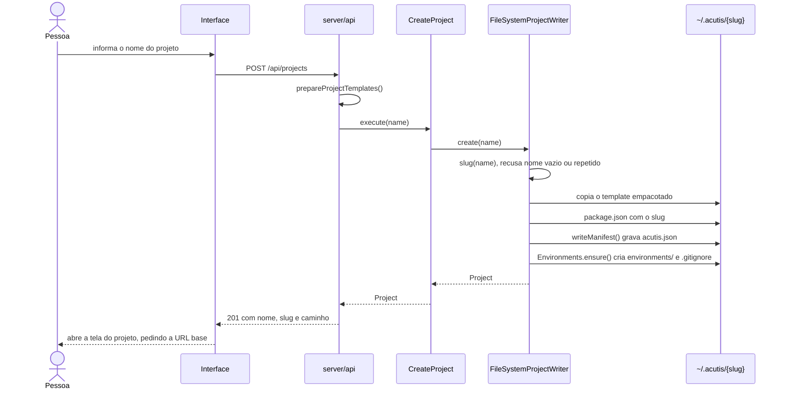

O projeto nasce sem git. Quem quiser versionar roda `git init` na pasta, e a partir daí o acutis passa a commitar sozinho, como no fluxo 15.

## 2. Clonar projeto de um repositório

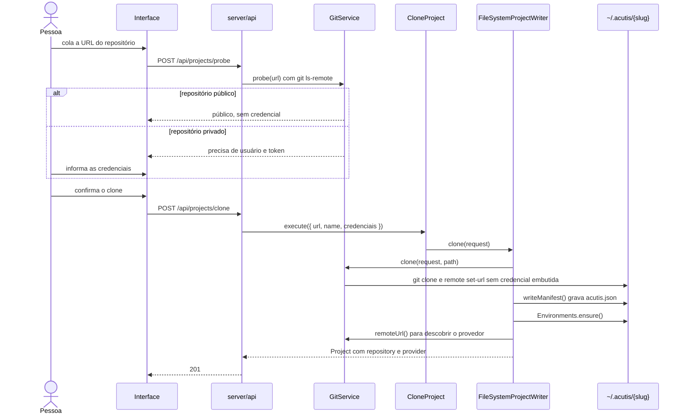

O `set-url` depois do clone é deliberado: a credencial serve à operação e não fica escrita no `.git/config`.

## 3. Configurar a IA

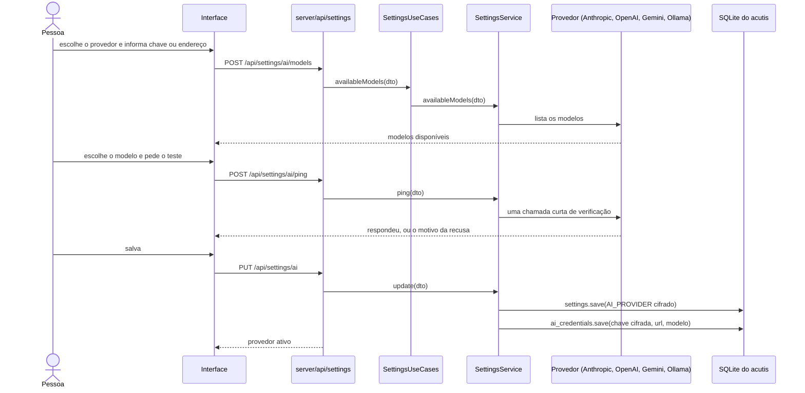

A chave vai cifrada em AES-256-GCM, e a chave de cifra mora em `<raiz>/runtime/app-key`, fora do banco. Escolher "Sem IA" desliga sem apagar cadastro: o acutis segue gravando e executando, e só as ações da coluna com IA em [USE-CASE-DIAGRAMS](USE-CASE-DIAGRAMS.md#quando-a-ia-entra) ficam indisponíveis.

## 4. Definir a URL base e os ambientes

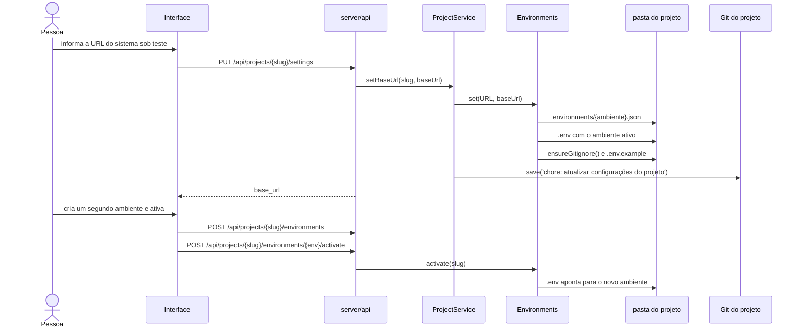

Os valores ficam fora do git: `.env` e `environments/` estão no `.gitignore`, porque cada máquina tem os seus e alguns são segredo. O que se versiona é o `.env.example`, com as chaves.

## 5. Gravar a autenticação

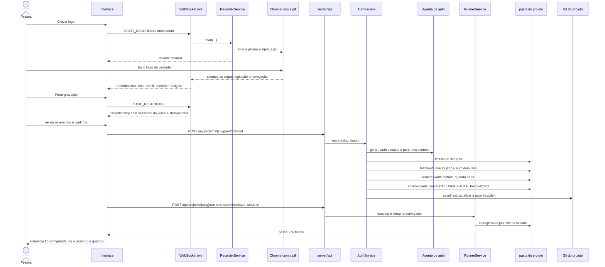

A senha nunca entra no spec: ela vira variável do ambiente ativo, e o `auth.events.json` é gravado sem os valores sensíveis. O `storage-state.json` fica no `.gitignore`, porque é sessão e não fonte.

## 6. Gravar um cenário

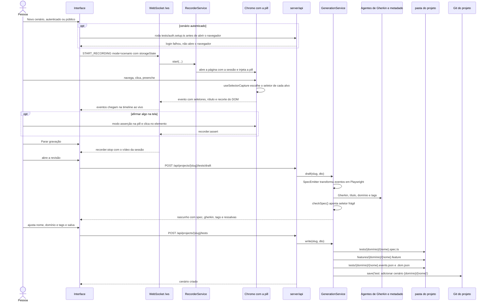

O rascunho é um passo separado de propósito: o spec chega à tela antes de existir arquivo, e é ali que se corrige o que a IA batizou.

## 7. Retomar a gravação de um passo

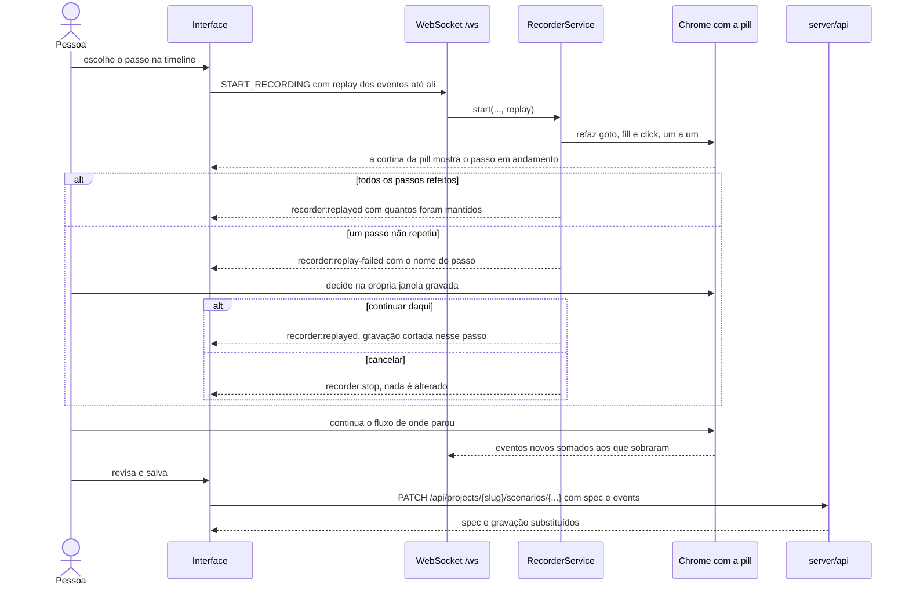

## 8. Executar um cenário

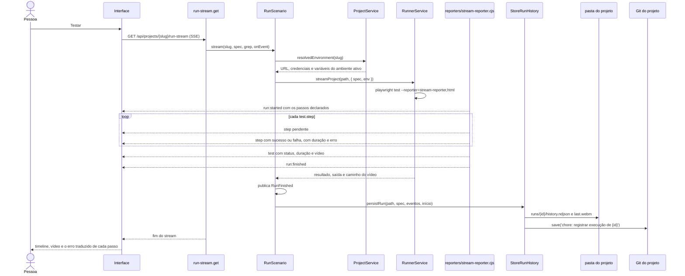

Passo vermelho traz a mensagem do Playwright já traduzida pela tela (`app/utils/run-failure.ts`), com a mensagem original disponível ao lado. Cenário pulado não entra: o Playwright reporta `skipped` sem executar.

## 9. Executar os cenários filtrados

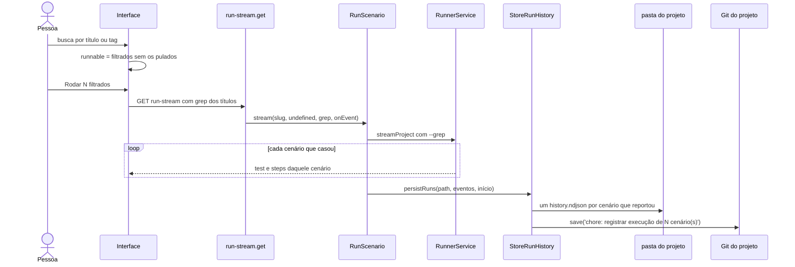

## 10. Editar ou mover um cenário

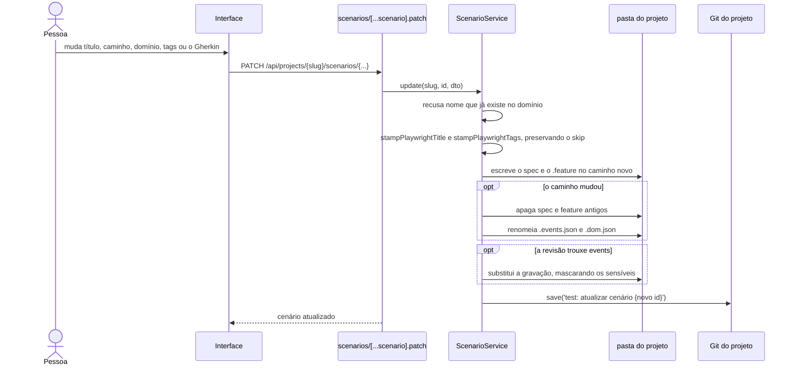

## 11. Pular e voltar a rodar

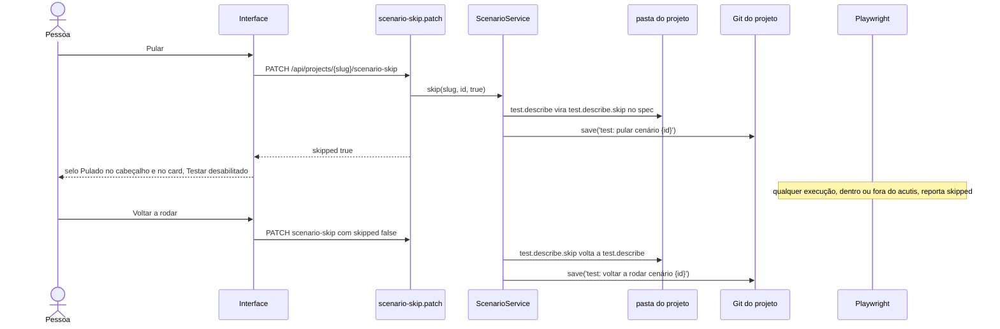

## 12. Excluir um cenário

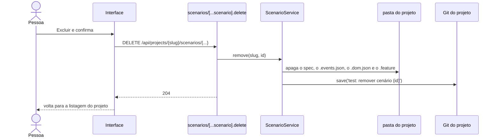

## 13. Corrigir o cenário com IA

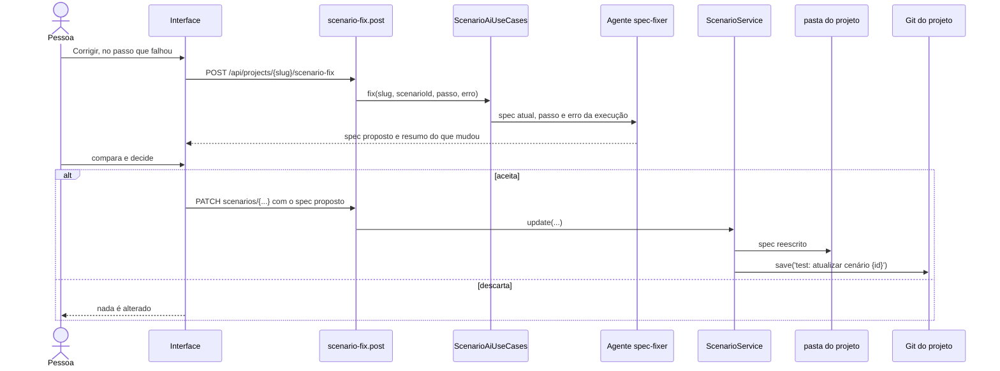

Sem provedor de IA cadastrado o botão Corrigir fica desabilitado, com a explicação no tooltip.

## 14. Sugerir data-testid

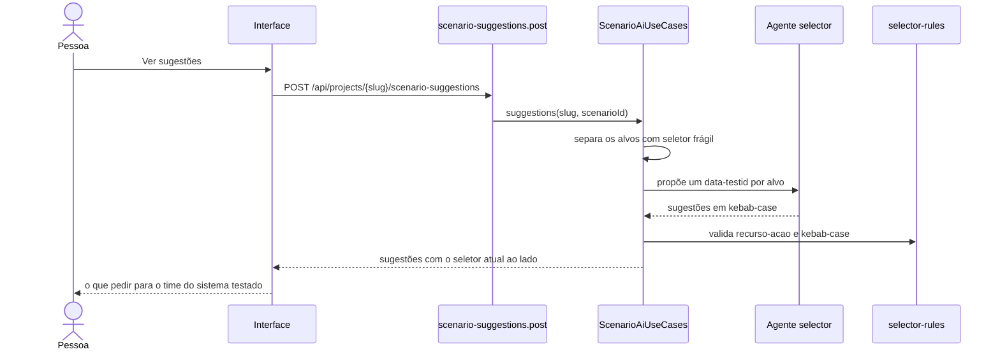

Este é o único fluxo que não escreve nada: a mudança precisa acontecer no sistema sob teste, não no projeto de testes.

## 15. O commit que toda ação faz

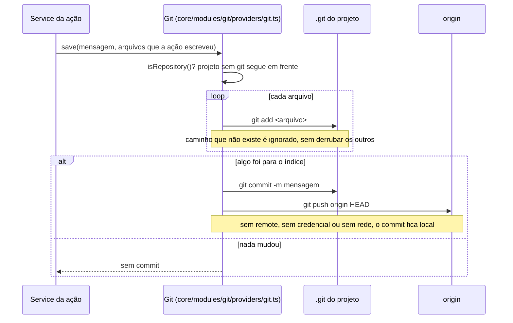

Um `add` por arquivo é o que garante o commit: com uma lista só, um caminho inexistente (o `.dom.json` que a gravação não capturou) fazia o git recusar tudo, e a ação inteira ficava pendente.

O prefixo separa o que é teste do que é infraestrutura do projeto:

| Ação | Mensagem |
|------|----------|
| Criar cenário | `test: adicionar cenário <domínio>/<nome>` |
| Editar ou mover cenário | `test: atualizar cenário <id>` |
| Pular cenário | `test: pular cenário <id>` |
| Voltar a rodar | `test: voltar a rodar cenário <id>` |
| Excluir cenário | `test: remover cenário <id>` |
| Gravar ou editar a autenticação | `test: atualizar a autenticação` |
| Dispensar a autenticação | `chore: dispensar a autenticação do projeto` |
| Salvar as configurações | `chore: atualizar configurações do projeto` |
| Clonar o projeto | `chore: registrar o projeto no acutis` |
| Registrar a execução | `chore: registrar execução de <id>` |
