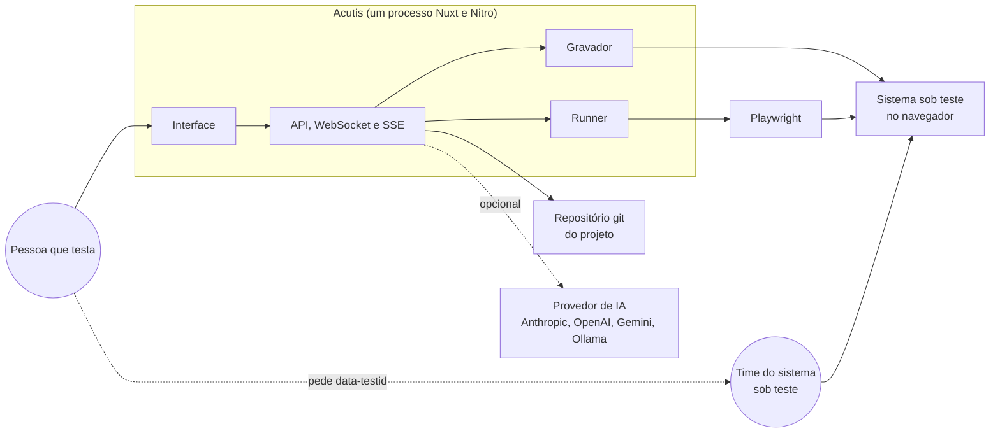
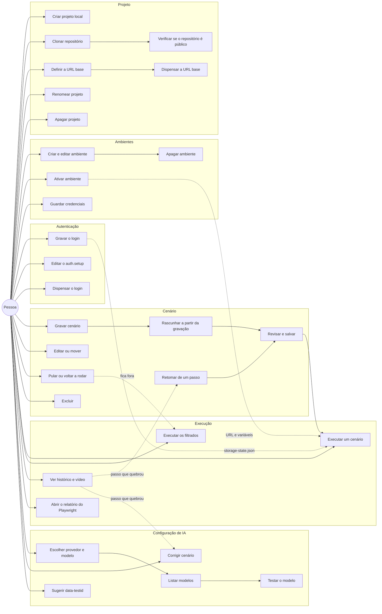
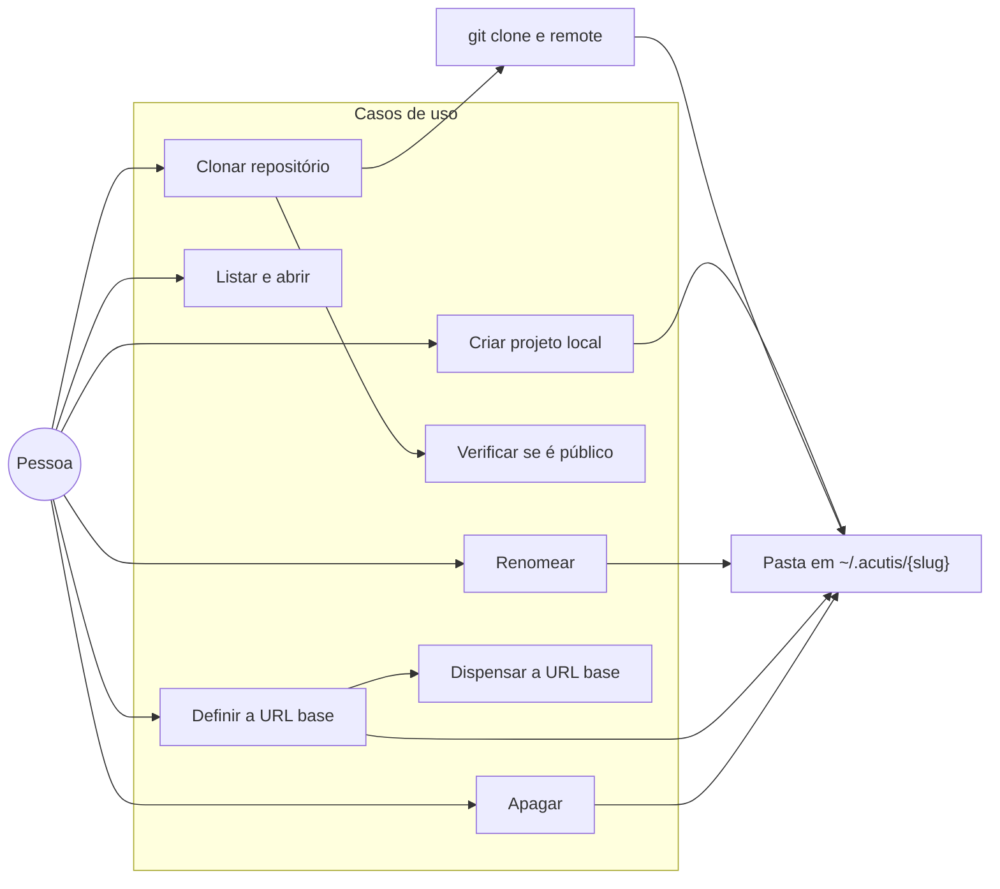
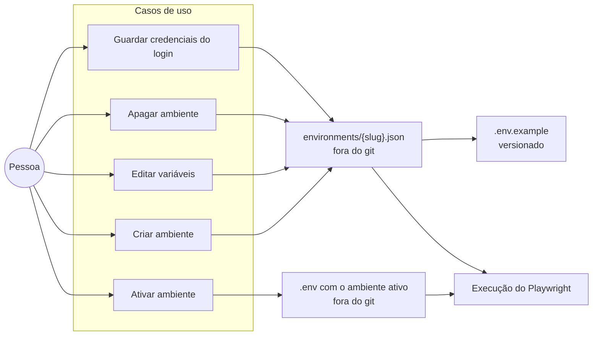
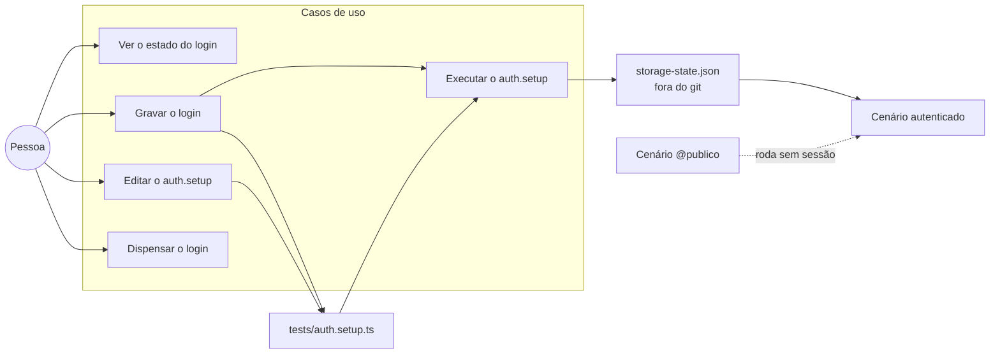
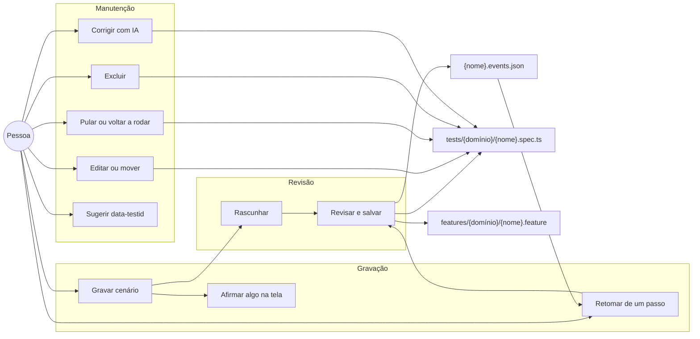
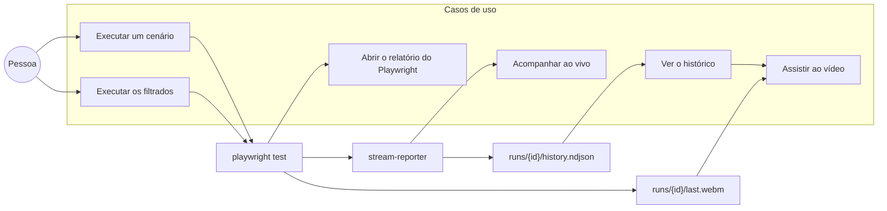
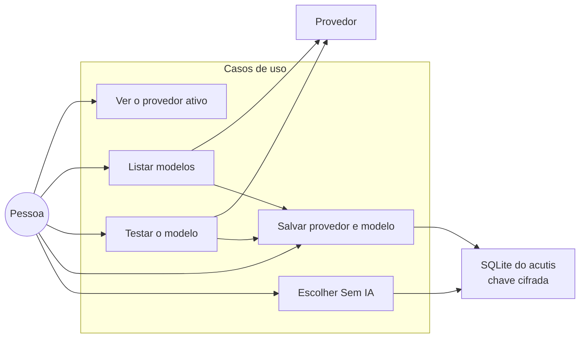

# Diagramas de casos de uso

O que o acutis faz, visto por quem usa e por quem é usado. A ordem dos passos de cada fluxo está em [SEQUENCE-DIAGRAMS](SEQUENCE-DIAGRAMS.md); a lista de endpoint por classe está em [USE-CASES](../USE-CASES.md).

## Sumário

| # | Diagrama | Responde |
|---|----------|----------|
| 1 | [Atores e sistemas](#1-atores-e-sistemas) | Quem age e com quem o acutis fala |
| 2 | [Panorama dos casos de uso](#2-panorama-dos-casos-de-uso) | Tudo que a pessoa pode fazer, por pacote |
| 3 | [Projeto](#3-projeto) | Criar, clonar, configurar e apagar |
| 4 | [Ambientes](#4-ambientes) | Onde moram URL, credenciais e variáveis |
| 5 | [Autenticação](#5-autenticação) | Como o login entra nos cenários |
| 6 | [Cenário](#6-cenário) | Gravar, revisar, editar, pular e excluir |
| 7 | [Execução](#7-execução) | Rodar, acompanhar e reabrir o que rodou |
| 8 | [Configuração de IA](#8-configuração-de-ia) | Escolher provedor, modelo e desligar |
| 9 | [Quando a IA entra](#quando-a-ia-entra) | O que muda com e sem provedor |
| 10 | [O que cada ação escreve no projeto](#10-o-que-cada-ação-escreve-no-projeto) | Qual arquivo nasce de qual caso de uso |

## 1. Atores e sistemas

O gravador e o runner falam com o mesmo navegador, em momentos diferentes: um observa a pessoa usando o sistema, o outro repete o que ela fez.

## 2. Panorama dos casos de uso

## 3. Projeto

Um diretório vira projeto quando tem `acutis.json`. Criar copia o template empacotado; clonar traz um repositório que já existe e acrescenta o manifesto. Apagar remove a pasta inteira, com os testes dentro.

## 4. Ambientes

O ambiente ativo entra na execução como ambiente do processo: URL, usuário, senha e o que mais o cenário usar chegam ao Playwright sem que o spec mencione valor nenhum. Marcar uma variável como segredo muda a máscara na tela, não onde ela é guardada.

## 5. Autenticação

Quatro estados aparecem na tela: nunca configurado, dispensado, configurado e falhando. O último vem da execução do próprio `auth.setup.ts`: é ela que decide se o login ainda funciona. Cenário marcado `@publico` roda sem sessão, o que permite testar a própria tela de login.

## 6. Cenário

A gravação fica guardada ao lado do spec (`.events.json`), e é ela que permite retomar de um passo depois. Pular marca o `describe` como `skip` no próprio arquivo, então vale também para quem rodar o Playwright fora do acutis.

## 7. Execução

Cada execução deixa três coisas: a linha do tempo passo a passo, o vídeo e, quando vermelha, o HTML da página no instante da falha. O histórico é por cenário, e a tela reabre execuções antigas com o mesmo desenho da execução ao vivo.

## 8. Configuração de IA

A instalação nasce sem IA. A variável `AI_PROVIDER` pré-configura o provedor antes da primeira tela, e "Sem IA" desliga sem apagar cadastro nenhum.

## Quando a IA entra

| Caso de uso | Com provedor | Sem provedor |
|-------------|--------------|--------------|
| Rascunhar cenário | Escreve o Gherkin, o título, o domínio e as tags, e nomeia os passos do spec | O spec sai dos eventos gravados, sem Gherkin e sem metadado |
| Gravar a autenticação | Escreve o `auth.setup.ts` e o `auth.feature` | Escreve o `auth.setup.ts` a partir dos eventos, sem o Gherkin |
| Corrigir cenário | Reescreve o spec a partir do erro da execução | Botão desabilitado |
| Sugerir data-testid | Propõe um nome por alvo frágil | Botão desabilitado |

Gravar, revisar, salvar, executar, pular e ver o resultado nunca dependem de IA.

## 10. O que cada ação escreve no projeto

| Caso de uso | Arquivos | Versiona |
|-------------|----------|----------|
| Criar projeto local | template, `acutis.json`, `.gitignore`, `environments/` | o projeto nasce sem git |
| Clonar repositório | repositório clonado, `acutis.json` | sim, ao salvar a primeira configuração |
| Definir a URL base | `environments/*.json`, `.env`, `.env.example`, `.gitignore` | `.env.example` e `.gitignore` |
| Criar ou ativar ambiente | `environments/*.json`, `.env` | nada, os dois estão no `.gitignore` |
| Gravar a autenticação | `tests/auth.setup.ts`, `auth.events.json`, `features/auth.feature`, `storage-state.json` | tudo, menos o `storage-state.json` |
| Dispensar a autenticação | `acutis.json` | sim |
| Salvar cenário | `tests/.../*.spec.ts`, `features/.../*.feature`, `*.events.json` | sim, o `.dom.json` fica fora |
| Editar ou mover cenário | os mesmos, no caminho novo | sim, com a remoção dos antigos |
| Pular ou voltar a rodar | o spec | sim |
| Excluir cenário | remove spec, feature e gravação | sim |
| Executar | `runs/{id}/history.ndjson`, `last.webm`, `results/`, `failure.html` | só o histórico; vídeo, `results/` e `failure.html` ficam no `.gitignore` |
| Configurar a IA | SQLite em `<raiz>/runtime` | nada, é configuração do acutis e não do projeto |

O commit e o push acontecem na própria ação, com os arquivos que ela escreveu. O prefixo diz o que mudou: `test:` no que é teste (cenário e autenticação), `chore:` no que é configuração ou histórico. O desenho está no fluxo 15 de [SEQUENCE-DIAGRAMS](SEQUENCE-DIAGRAMS.md#15-o-commit-que-toda-ação-faz).
