# Diagramas de casos de uso

O que o acutis faz, visto por quem usa e por quem é usado. A ordem dos passos de cada fluxo está em [SEQUENCE-DIAGRAMS](SEQUENCE-DIAGRAMS.md), com o endpoint e a classe de cada um; o passo a passo para quem está começando está no [guia rápido](../QUICK-START.md).

## Sumário

| # | Diagrama | Responde |
|---|----------|----------|
| 1 | [Atores e sistemas](#1-atores-e-sistemas) | Quem age e com quem o acutis fala |
| 2 | [Panorama dos casos de uso](#2-panorama-dos-casos-de-uso) | Tudo que a pessoa pode fazer, por pacote |
| 3 | [Ciclo de vida da ferramenta](#3-ciclo-de-vida-da-ferramenta) | Como o acutis sobe e o que ele carrega junto |
| 4 | [Projeto](#4-projeto) | Criar, clonar, configurar, abrir e apagar |
| 5 | [Ambientes](#5-ambientes) | Onde moram URL, credenciais e variáveis |
| 6 | [Autenticação](#6-autenticação) | Como o login entra nos cenários |
| 7 | [Cenário](#7-cenário) | Gravar, revisar, editar, pausar e excluir |
| 8 | [Execução](#8-execução) | Rodar um, rodar os filtrados e acompanhar |
| 9 | [Relatórios](#9-relatórios) | O que sobra de todas as execuções |
| 10 | [Sincronização com o repositório](#10-sincronização-com-o-repositório) | Como o time compartilha os testes |
| 11 | [Configuração de IA](#11-configuração-de-ia) | Escolher provedor, modelo e desligar |
| 12 | [Telemetria](#12-telemetria) | O que sai da máquina, e só por clique |
| 13 | [Quando a IA entra](#13-quando-a-ia-entra) | O que muda com e sem provedor |
| 14 | [Os estados que a tela mostra](#14-os-estados-que-a-tela-mostra) | Autenticação, cenário e repositório |
| 15 | [O que cada ação escreve no projeto](#15-o-que-cada-ação-escreve-no-projeto) | Qual arquivo nasce de qual caso de uso |

## 1. Atores e sistemas

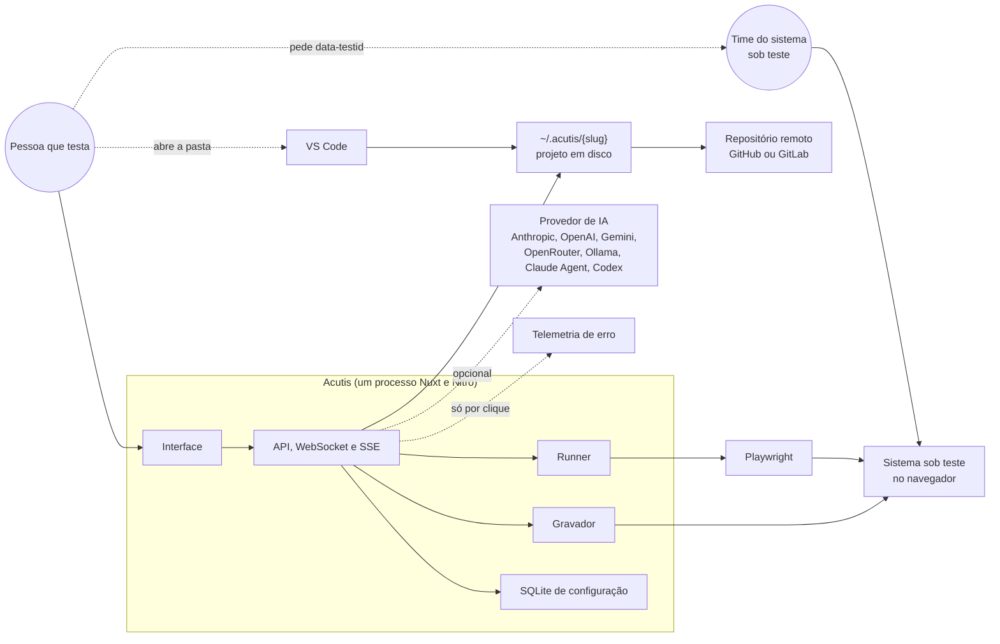

O gravador e o runner falam com o mesmo navegador, em momentos diferentes: um observa a pessoa usando o sistema, o outro repete o que ela fez. Tudo que a ferramenta produz mora em disco, dentro da pasta do projeto, e é o git que leva isso ao resto do time.

## 2. Panorama dos casos de uso

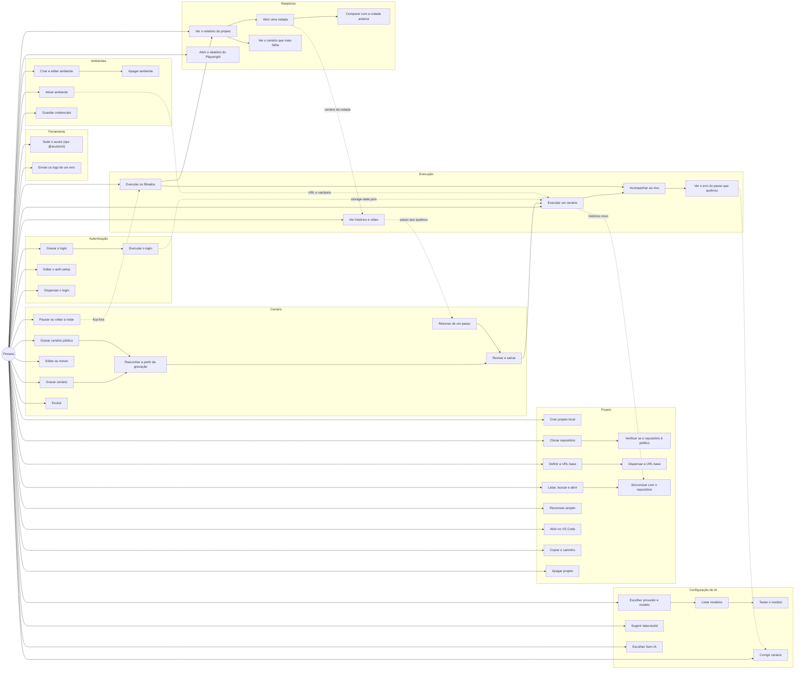

## 3. Ciclo de vida da ferramenta

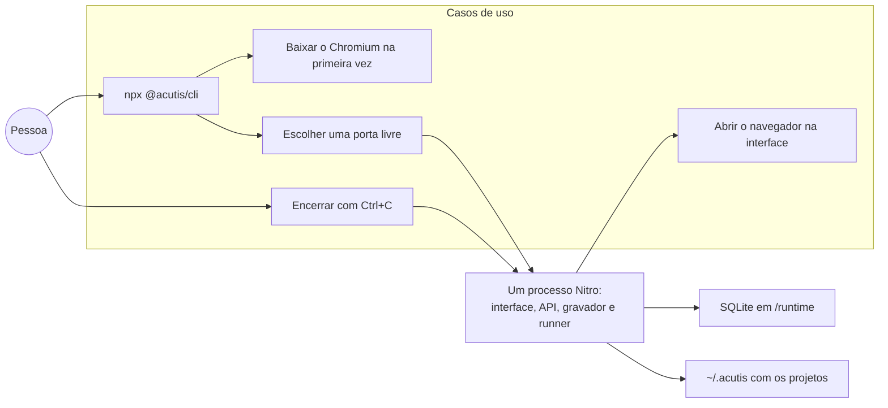

Não há instalação, serviço nem container: o comando sobe tudo numa porta livre da máquina e abre o navegador nela. O que sobrevive entre execuções são os projetos em `~/.acutis` e o banco de configuração da ferramenta.

## 4. Projeto

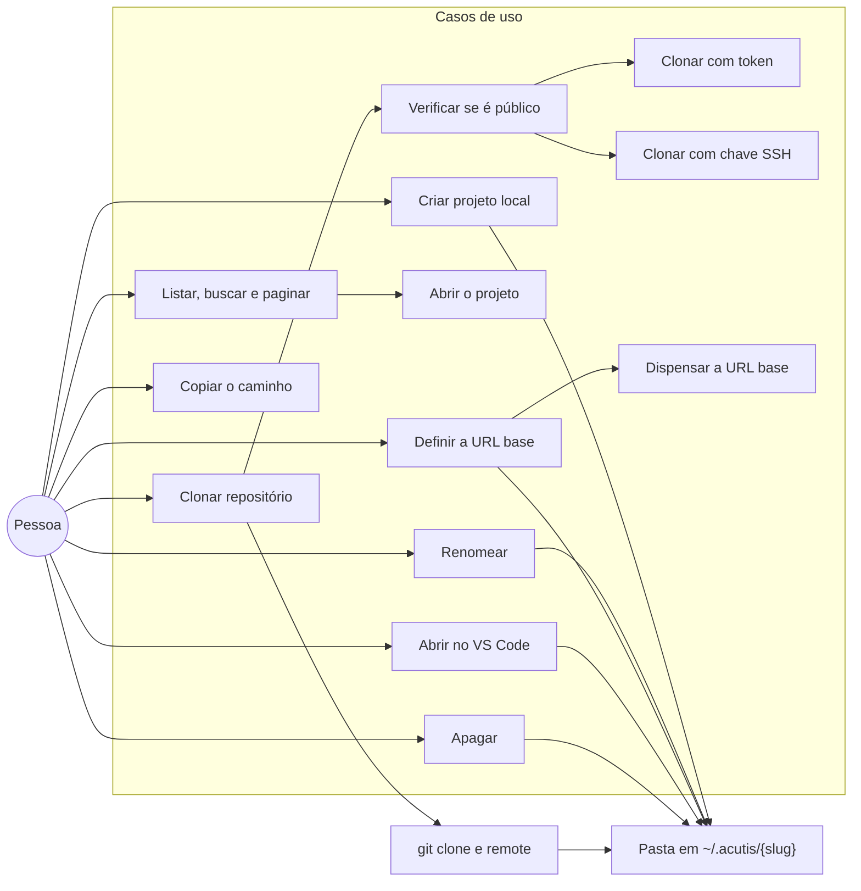

Um diretório vira projeto quando tem `acutis.json`. Criar copia o template empacotado; clonar traz um repositório que já existe e acrescenta o manifesto. Repositório privado pede token ou chave SSH, e nenhum dos dois fica gravado no `.git/config`. Apagar remove a pasta inteira, com os testes dentro.

## 5. Ambientes

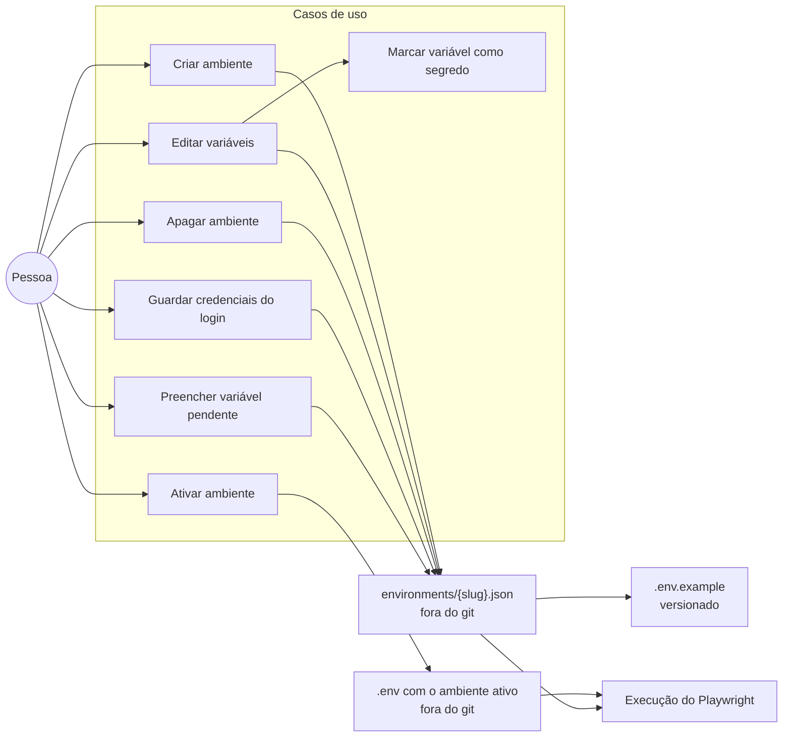

O ambiente ativo entra na execução como ambiente do processo: URL, usuário, senha e o que mais o cenário usar chegam ao Playwright sem que o spec mencione valor nenhum. Marcar uma variável como segredo muda a máscara na tela, não onde ela é guardada. Variável declarada e sem valor no ambiente ativo derruba a execução, então a tela do projeto avisa antes de rodar.

## 6. Autenticação

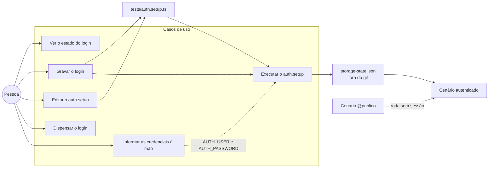

Quatro estados aparecem na tela: nunca configurado, dispensado, configurado e falhando. O último vem da execução do próprio `auth.setup.ts`: é ela que decide se o login ainda funciona. Gravação em que a senha não pôde ser deduzida pede as credenciais na tela, e elas viram variáveis do ambiente ativo. Cenário marcado `@publico` roda sem sessão, o que permite testar a própria tela de login.

## 7. Cenário

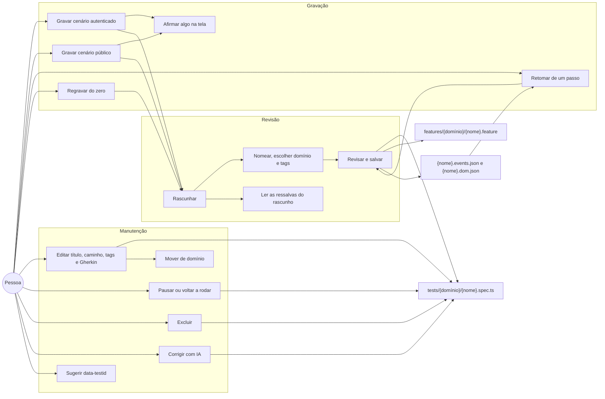

A gravação fica guardada ao lado do spec (`.events.json`, e o recorte de DOM em `.dom.json`), e é ela que permite retomar de um passo depois. Pausar marca o `describe` como `skip` no próprio arquivo, então vale também para quem rodar o Playwright fora do acutis.

## 8. Execução

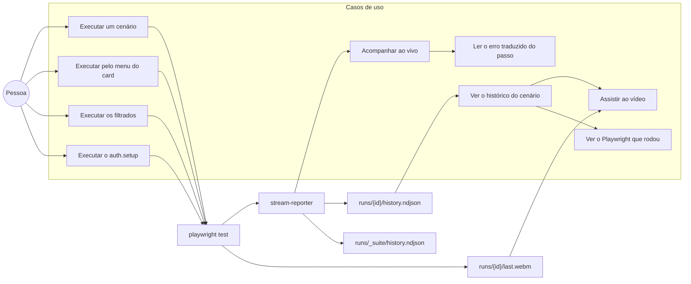

Cada execução deixa quatro coisas: a linha do tempo passo a passo, o vídeo, o código Playwright que rodou naquele momento e, quando vermelha, o HTML da página no instante da falha. O histórico por cenário guarda a execução avulsa e a que veio de uma rodada; a rodada inteira também vira uma linha própria, que é o que o relatório do projeto lê. A tela reabre execuções antigas com o mesmo desenho da execução ao vivo.

## 9. Relatórios

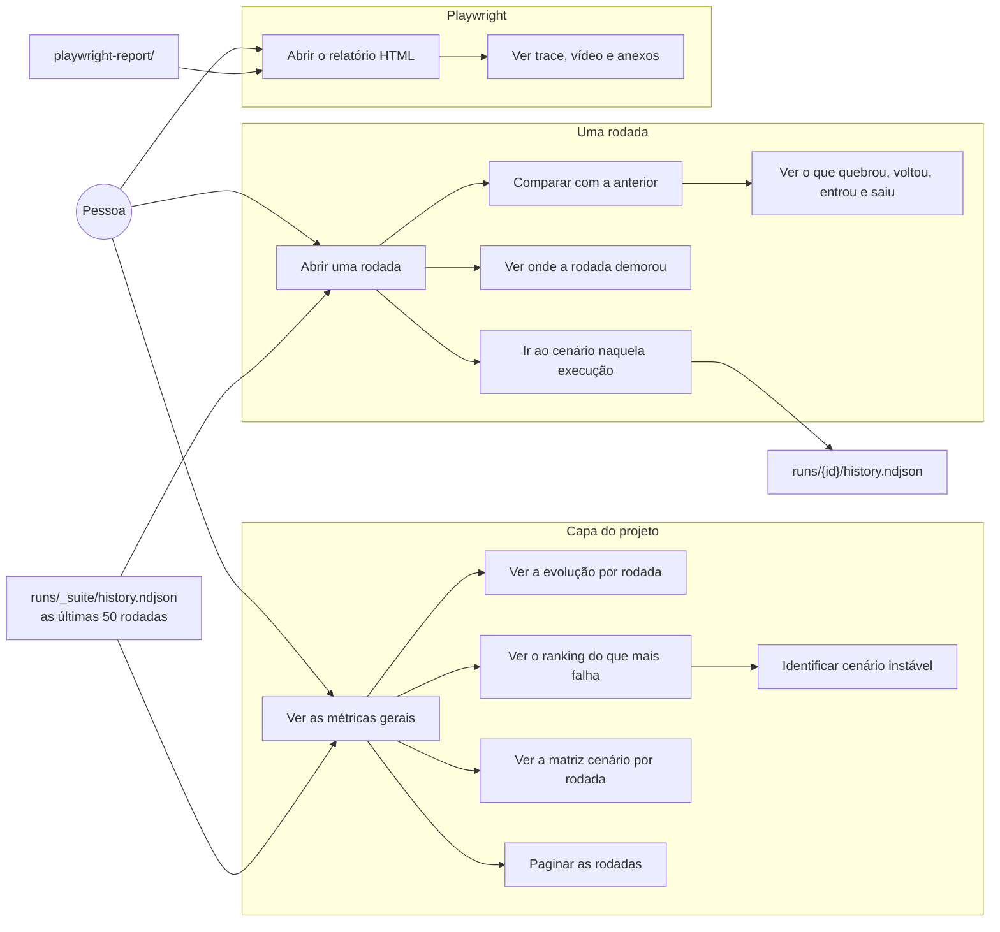

O relatório do projeto é do acutis e lê o histórico versionado, então quem clonar o repositório vê as rodadas que os outros rodaram. O relatório HTML é o do Playwright, gerado pela última execução daquela máquina, e é para onde se vai quando o assunto é trace e anexo.

## 10. Sincronização com o repositório

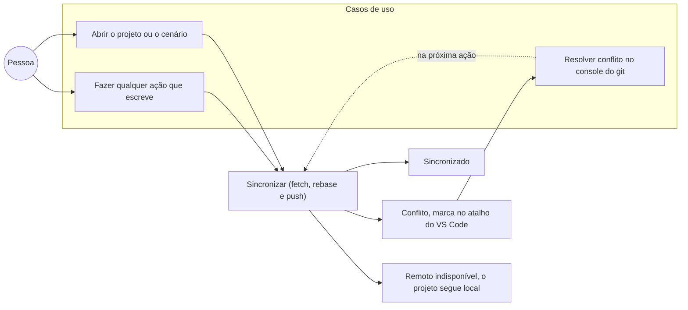

A sincronização acontece sozinha e não aparece em lugar nenhum enquanto dá certo. Só dois casos chegam à tela, e nenhum dos dois interrompe o trabalho: conflito de verdade (o mesmo arquivo mudou dos dois lados, ou há alteração local sem commit) e remoto que não respondeu. Conflito não é resolvido pela ferramenta: o rebase é abortado e quem decide é quem conhece os dois lados.

## 11. Configuração de IA

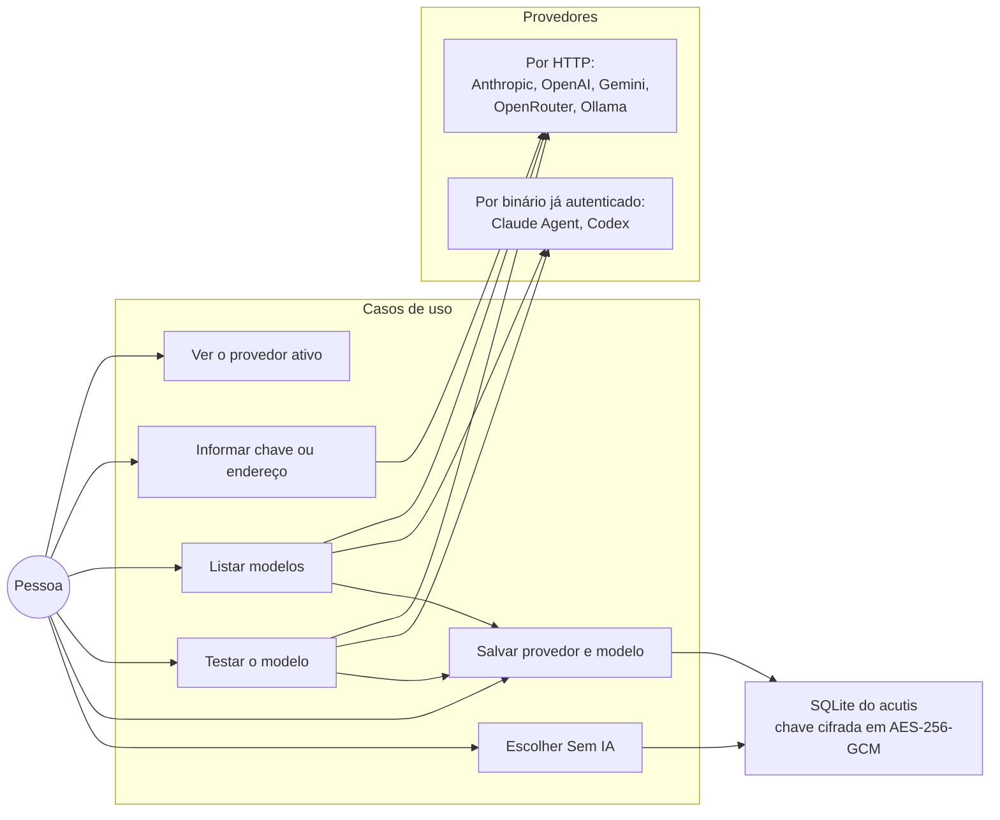

A instalação nasce sem IA. Os provedores por HTTP pedem chave (Ollama e os locais não pedem); Claude Agent e Codex não falam HTTP, rodam a ferramenta instalada na máquina, que já está autenticada. A variável `AI_PROVIDER` pré-configura o provedor antes da primeira tela, e "Sem IA" desliga sem apagar cadastro nenhum.

## 12. Telemetria

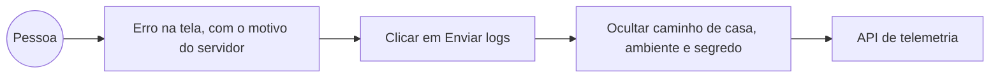

Nada sai da máquina sozinho: o envio é sempre um clique na notificação de erro, e o que vai é a mensagem, o stack, a versão do CLI, a do Node, a plataforma e um identificador da instalação. Caminho de casa, variáveis de ambiente e valores sensíveis são ocultados antes do envio.

## 13. Quando a IA entra

| Caso de uso | Com provedor | Sem provedor |
|-------------|--------------|--------------|
| Rascunhar cenário | Escreve o Gherkin, o título, o domínio e as tags, e nomeia os passos do spec | O spec sai dos eventos gravados, sem Gherkin e sem metadado |
| Gravar a autenticação | Escreve o `auth.setup.ts`, corrige o que as regras apontarem, executa e tenta de novo até duas vezes, e escreve o `auth.feature` | Escreve o `auth.setup.ts` a partir dos eventos, sem correção e sem Gherkin |
| Corrigir cenário | Reescreve o spec a partir do que as regras apontaram e da gravação, com o passo que falhou visível na tela | Botão desabilitado |
| Sugerir data-testid | Propõe um nome por alvo frágil | Botão desabilitado |

Gravar, revisar, salvar, executar, pausar, ver o resultado e ler os relatórios nunca dependem de IA.

## 14. Os estados que a tela mostra

### Autenticação do projeto

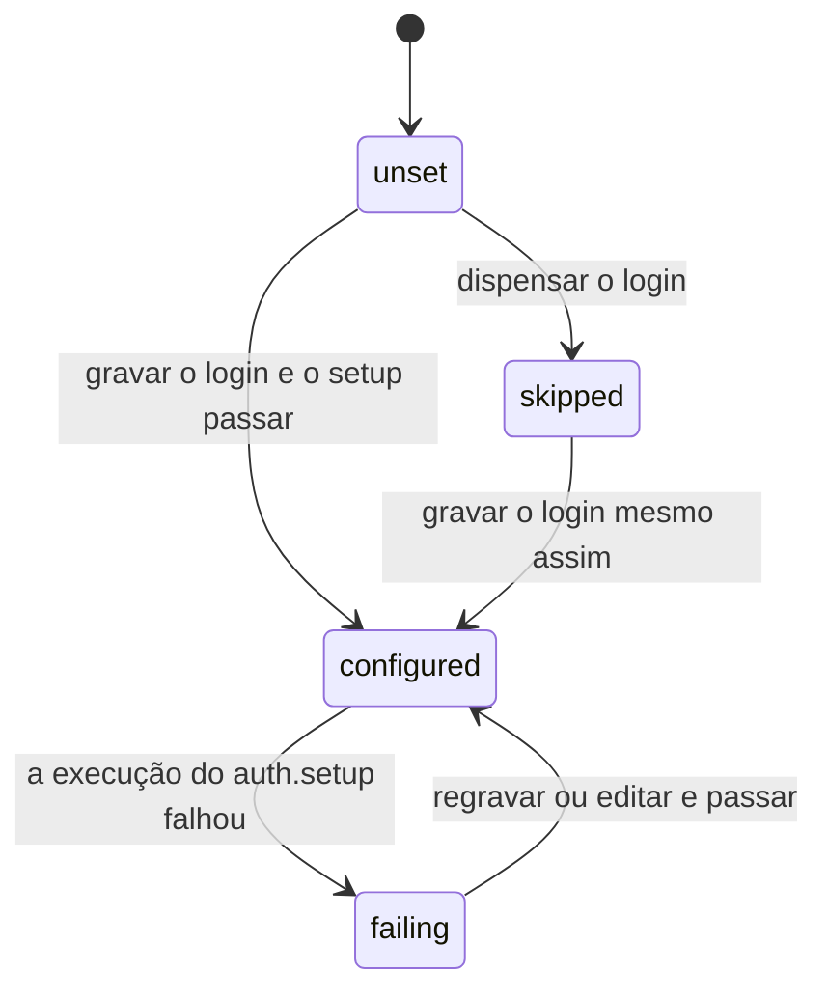

O estado não é um campo que alguém marca: `configured` e `failing` saem da última execução do `auth.setup.ts` guardada no histórico.

### Cenário

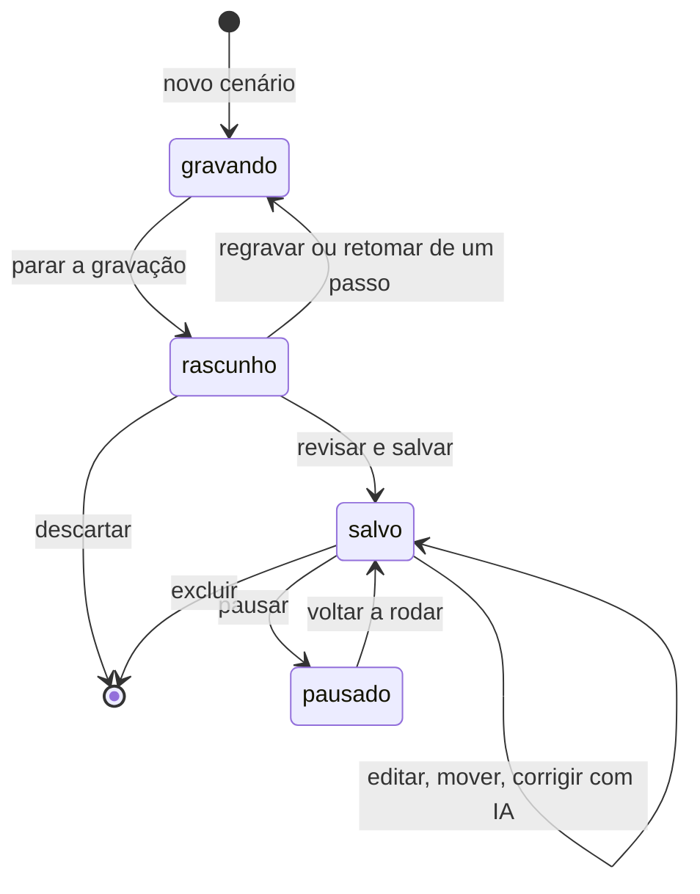

Rascunho não existe em disco: até salvar, o que há é o spec na tela.

### Repositório do projeto

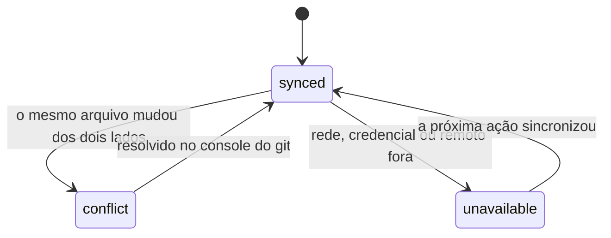

Projeto sem git nunca sai de `synced`: toda operação de repositório é inócua fora de um.

## 15. O que cada ação escreve no projeto

| Caso de uso | Arquivos | Versiona |
|-------------|----------|----------|
| Criar projeto local | template, `acutis.json`, `.gitignore`, `environments/` | o projeto nasce sem git |
| Clonar repositório | repositório clonado, `acutis.json` | sim, ao salvar a primeira configuração |
| Definir a URL base | `environments/*.json`, `.env`, `.env.example`, `.gitignore` | `.env.example` e `.gitignore` |
| Criar ou ativar ambiente | `environments/*.json`, `.env` | nada, os dois estão no `.gitignore` |
| Gravar a autenticação | `tests/auth.setup.ts`, `auth.events.json`, `auth.dom.json`, `features/auth.feature`, `playwright.config.ts`, `storage-state.json` | tudo, menos o `storage-state.json` e o `auth.dom.json` |
| Guardar as credenciais do login | `environments/*.json`, `.env` | nada |
| Dispensar a autenticação | `acutis.json` | sim |
| Salvar cenário | `tests/.../*.spec.ts`, `features/.../*.feature`, `*.events.json`, `*.dom.json` | sim, o `.dom.json` fica fora pelo `.gitignore` |
| Editar ou mover cenário | os mesmos, no caminho novo | sim, com a remoção dos antigos |
| Pausar ou voltar a rodar | o spec | sim |
| Excluir cenário | remove spec, feature e gravação | sim |
| Executar um cenário | `runs/{id}/history.ndjson`, `last.webm`, `results/`, `failure.html`, `playwright-report/` | só o histórico do cenário |
| Executar os filtrados | um `runs/{id}/history.ndjson` por cenário, mais `runs/_suite/history.ndjson` e o `.gitattributes` | os históricos entram no commit da execução; o `.gitattributes` é versionado, e entra no commit seguinte que o alcançar |
| Apagar projeto | remove a pasta inteira | nada, o remoto continua onde está |
| Configurar a IA | SQLite em `<raiz>/runtime` | nada, é configuração do acutis e não do projeto |

O commit e o push acontecem na própria ação, com os arquivos que ela escreveu. O prefixo diz o que mudou: `test:` no que é teste (cenário e autenticação), `chore:` no que é configuração ou histórico. O desenho está no fluxo 27 de [SEQUENCE-DIAGRAMS](SEQUENCE-DIAGRAMS.md#27-o-commit-que-toda-ação-faz).
