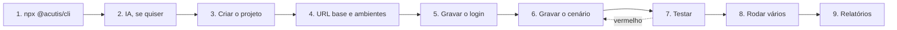

# Guia rápido

Este é o manual do Acutis: do primeiro comando ao primeiro relatório, com o que aparece em cada tela e o que fazer quando algo não sai como esperado.

O Acutis grava o que você faz no navegador e escreve, a partir disso, um teste Playwright de verdade. Depois roda esse teste quando você pedir, mostrando passo a passo, guardando o vídeo e registrando cada execução. Você não precisa saber Playwright para usar, e o que ele escreve continua sendo um projeto Playwright comum, que roda fora daqui.

## Sumário

| Passo | Assunto |
|-------|---------|
| [1](#1-subir-a-ferramenta) | Subir a ferramenta |
| [2](#2-configurar-a-ia-opcional) | Configurar a IA (opcional) |
| [3](#3-criar-o-projeto) | Criar o projeto, local ou a partir do Git |
| [4](#4-definir-a-url-base-e-os-ambientes) | Definir a URL base e os ambientes |
| [5](#5-gravar-a-autenticação) | Gravar a autenticação |
| [6](#6-gravar-o-primeiro-cenário) | Gravar o primeiro cenário |
| [7](#7-testar) | Testar |
| [8](#8-rodar-vários-cenários) | Rodar vários cenários |
| [9](#9-ver-os-relatórios) | Ver os relatórios |
| [10](#10-manter-os-cenários) | Manter os cenários |
| [11](#11-trabalhar-em-equipe) | Trabalhar em equipe |
| [12](#12-o-que-fica-em-disco) | O que fica em disco |
| [13](#13-quando-algo-dá-errado) | Quando algo dá errado |
| [14](#14-atalhos-e-detalhes-da-tela) | Atalhos e detalhes da tela |

## O caminho inteiro, de uma olhada



Os passos 2 e 5 são opcionais: dá para usar a ferramenta inteira sem IA, e um sistema sem login pula a autenticação.

## Antes de começar

- **Node 22 ou mais novo.** Confira com `node -v`.
- **Nada para instalar.** O comando roda direto pelo `npx`, e o Chromium do Playwright é baixado na primeira execução (só na primeira, e leva alguns minutos).
- **Onde as coisas ficam.** Cada projeto vira uma pasta em `~/.acutis/<projeto>`, com os testes dentro. Para usar outro lugar, defina `ACUTIS_PROJECTS_PATH`.
- **O sistema que você vai testar** precisa estar no ar e acessível pela máquina: em `localhost`, num ambiente de homologação ou numa rede interna alcançada por VPN. O navegador que grava e o que executa são os da sua máquina, então tudo que ela alcança, eles alcançam. Com VPN, ela precisa estar conectada na hora de gravar e na hora de rodar.

## 1. Subir a ferramenta

```sh
npx @acutis/cli@latest
```

O `@latest` garante a versão mais nova mesmo que o `npx` já tenha uma em cache. O que acontece:

1. O Chromium é conferido, e baixado se ainda não existir.
2. Uma porta livre é escolhida pelo sistema, então o endereço muda a cada execução. É normal.
3. O navegador abre sozinho na interface.

Para encerrar, `Ctrl+C` no terminal. Tudo o que você produziu fica em disco: da próxima vez que subir, os projetos estão lá.

O que sobe é um processo só, que serve a interface, a API, o gravador e o runner. Não há serviço em segundo plano, container nem porta fixa para liberar.

## 2. Configurar a IA (opcional)

A instalação nasce **sem IA**, e isso é uma escolha, não uma pendência. Gravar, salvar, executar, pausar, ver o resultado e ler os relatórios funcionam sem nenhum provedor configurado.

Com IA ligada, três coisas mudam:

| O que ganha | Sem IA |
|-------------|--------|
| O cenário sai com título, domínio, tags e o texto em Gherkin, e os passos do teste ganham nome | O teste sai dos eventos gravados, sem Gherkin e sem metadado; você nomeia na revisão |
| O `auth.setup.ts` é conferido, corrigido e testado antes de chegar a você | O arquivo sai direto dos eventos, com os avisos das regras na tela |
| Os botões **Corrigir** e **Ver sugestões** ficam disponíveis | Os dois ficam desabilitados, com a explicação no tooltip |

Para configurar, abra as **Configurações** na barra lateral esquerda e:

1. Escolha o provedor: **Anthropic**, **Claude Agent**, **Codex**, **Google Gemini**, **Ollama**, **OpenAI**, **OpenRouter** ou **Sem IA**.
2. Informe a chave, e o endereço quando o provedor tiver um alternativo. Ollama, Claude Agent e Codex não pedem chave.
3. Clique para **listar os modelos**: a lista vem do próprio provedor, com o que a sua chave alcança.
4. Escolha o modelo e use o **teste** antes de salvar. Ele faz uma chamada curta de verdade e responde se funcionou, com qual modelo e em quanto tempo.
5. Salve.

Sobre os provedores locais: **Claude Agent** e **Codex** não falam HTTP. Eles rodam a ferramenta que já está instalada e autenticada na sua máquina, então não há chave nem endereço para cadastrar, só o modelo. Se a ferramenta não estiver instalada, a tela mostra o link da documentação oficial de instalação.

A chave é guardada cifrada (AES-256-GCM) no banco da ferramenta, e a chave de cifra fica fora do banco. Escolher **Sem IA** depois não apaga cadastro nenhum: desliga, e voltar é só escolher o provedor de novo.

Quem quiser subir já com um provedor definido pode informar `AI_PROVIDER` no ambiente antes de rodar o comando.

## 3. Criar o projeto

Na home, o botão **Adicionar** abre um modal com duas abas. No primeiro acesso, com a lista vazia, os dois atalhos do estado inicial levam ao mesmo lugar.

### Aba Template

Para começar do zero. Você informa o **nome**, e o Acutis cria a pasta com um projeto Playwright já configurado: `playwright.config.ts`, a pasta `tests/`, o `.gitignore` e os ambientes.

O projeto nasce **sem git**. Se quiser versionar, rode `git init` na pasta e adicione um remote; a partir daí o Acutis passa a commitar sozinho o que cada ação escreve.

### Aba Git

Para trazer um projeto que já existe, seu ou do time. Cole a URL do repositório (GitHub, GitLab ou qualquer outro) e o Acutis **sonda o repositório sozinho** enquanto você digita, para saber se ele é público.

- **Público**: nada mais é pedido.
- **Privado**: escolha **Token** ou **Chave SSH**. A ferramenta já pré-seleciona pelo formato da URL (`https://` sugere token, `git@` sugere SSH).

Você pode informar também uma **branch** específica. Nem o token nem a chave ficam gravados: o token sai da URL do remote logo depois do clone, e a chave SSH vive num arquivo temporário que é apagado ao fim.

Criado ou clonado, você cai direto na tela do projeto.

## 4. Definir a URL base e os ambientes

### A URL base

No projeto novo, o modal de configurações abre sozinho pedindo o endereço do sistema que você vai testar (por exemplo `http://localhost:8000`). É de lá que o navegador parte ao gravar, e é o `baseURL` das execuções.

Se o seu caso não tem uma URL única, use **Dispensar**: a tela para de pedir, e cada ambiente passa a trazer a sua.

### Ambientes

Um ambiente é um conjunto de valores: a URL, o usuário, a senha e o que mais os seus cenários usarem. O seletor no topo da tela do projeto mostra o **ambiente ativo** e permite trocar; o lápis abre o editor, onde você pode:

- criar, renomear e apagar ambientes;
- editar as variáveis, uma linha por chave e valor;
- marcar uma variável como **segredo**, o que troca o valor por uma máscara na tela.

Trocar de ambiente é o que faz o mesmo cenário rodar contra local, homologação ou qualquer outro alvo, **sem tocar no teste**: os valores chegam ao Playwright como ambiente do processo, e o teste só menciona o nome da variável.

Duas coisas importantes:

- Os valores ficam **fora do git** (`environments/` e `.env` estão no `.gitignore`), porque cada máquina tem os seus e alguns são segredo. O que se versiona é o `.env.example`, com as chaves e sem os valores.
- Variável que um cenário usa e que está vazia no ambiente ativo aparece como **pendente** na tela do projeto, com um botão **Preencher**. Vale resolver antes de rodar: variável vazia derruba a execução, e a mensagem do Playwright não diz que o motivo foi esse.

## 5. Gravar a autenticação

Se o sistema tem login, grave-o uma vez e todos os cenários seguintes já partem autenticados. Na tela do projeto, o cartão de autenticação oferece **Configurar** (ou **Gravar login**, na tela de autenticação) e **Não precisa de login**.

O fluxo é este:

1. O navegador abre na URL base com a **pill** do gravador na tela.
2. Você faz o login de verdade, como um usuário faria.
3. Clica em **Parar** na pill, ou no botão da tela.
4. Revê a gravação e confirma em **Gerar autenticação**.

O que o Acutis faz a partir daí:

- escreve o `tests/auth.setup.ts`;
- guarda usuário e senha como variáveis do ambiente ativo (`AUTH_USER` e `AUTH_PASSWORD`), com a senha marcada como segredo. **A senha nunca entra no arquivo de teste**, e a gravação salva em disco vai sem ela;
- com IA ligada, confere o arquivo contra as regras, executa o login de verdade e, se algo falhar, devolve o erro ao modelo para corrigir, até duas vezes;
- executa o setup e guarda a sessão em `storage-state.json`, que fica fora do git.

Se a gravação não permitiu deduzir usuário e senha, a tela pede os dois, e eles vão para o ambiente ativo do mesmo jeito.

O estado da autenticação aparece como um selo, e ele não é um campo que alguém marca: sai da última execução do próprio `auth.setup.ts`.

| Selo | O que significa |
|------|-----------------|
| (sem selo) | Nunca configurada. A tela convida a gravar |
| **Configurada** | O login rodou e gravou a sessão |
| **Falhando** | A última execução do login falhou. Regrave ou edite o arquivo |
| **Dispensada** | Você disse que o projeto não tem login |

Na tela de autenticação dá para **editar o arquivo à mão** e **testar o login** quando quiser, para saber se ele ainda funciona. É o teste mais barato de rodar quando os cenários começam a falhar todos juntos.

## 6. Gravar o primeiro cenário

Na tela do projeto, **Novo cenário** oferece dois tipos:

- **Cenário autenticado**: o Acutis roda o login antes de abrir o navegador. Se o login falhar, o navegador não abre e a tela mostra o passo que quebrou, o que evita gravar meia hora em cima de uma sessão que não existe.
- **Cenário público**: grava sem sessão nenhuma, e o cenário sai marcado `@publico`. É assim que se testa a própria tela de login, o cadastro ou uma landing.

### A pill do gravador

Ela flutua sobre a página gravada e é por ali que você controla a gravação:

| Botão | O que faz |
|-------|-----------|
| **Pausar / Retomar** | Congela a gravação para você navegar sem registrar nada |
| **Assert** | Liga o modo de asserção: o próximo clique escolhe o elemento e abre as opções |
| **Conferir a URL** | Registra que, naquele ponto, a URL é a que está na barra |
| **Hover** | Registra passar o mouse sobre um elemento, para menus que só aparecem assim |
| **Cancelar** | Descarta a gravação inteira, com uma confirmação antes |
| **Parar** | Encerra e leva você para a revisão |

No modo de asserção, ao clicar num elemento você escolhe o que quer afirmar sobre ele: **Existe**, **Visível**, **Oculto**, **Marcado**, **Desabilitado**, **Texto igual a**, **Valor igual a** ou **Contém texto**. É isso que transforma um passeio pela tela num teste com verificação de verdade.

Clique, digitação e navegação são registrados sozinhos. Para cada alvo, o gravador escolhe o seletor mais estável que encontrar, dando preferência ao que tem significado (`data-testid`, `aria-label`, `name`) em vez de id gerado na hora.

### A revisão

Parada a gravação, abre a tela de revisão com a **linha do tempo** dos eventos e o vídeo da sessão. Aqui você tem três saídas:

- **Gravar novamente**: descarta e recomeça, mantendo o tipo (autenticado continua autenticado).
- **Retomar de um passo**: clique num passo da linha do tempo e o navegador refaz sozinho tudo que veio antes dele, devolvendo a gravação a você dali para frente. Se um passo não puder ser refeito, uma cortina aparece na janela gravada com o nome do passo e duas opções: **Assumir daqui** ou **Cancelar**.
- **Gerar cenário**: segue para a etapa seguinte.

Gerado o rascunho, você revisa antes de qualquer arquivo existir:

| Campo | Para que serve |
|-------|----------------|
| **Título do cenário** | O nome que aparece na listagem e no relatório |
| **Arquivo** | O nome do `.spec.ts` e do `.feature` |
| **Domínio** | A pasta que agrupa os cenários (`login`, `checkout`, `cadastro`) |
| **Tags** | Rótulos que a busca e a execução filtrada usam |
| **Cenário (Gherkin)** | O texto legível do teste, quando há IA |
| **Teste (Playwright)** | O código que vai rodar; dá para editar aqui mesmo |

Se a gravação dependeu de algum seletor frágil, ou usou um valor que deveria ser variável, as **ressalvas** aparecem acima dos campos. Elas não impedem salvar: são o que vale a pena olhar antes.

**Salvar** escreve os arquivos, e o cenário passa a existir no projeto.

## 7. Testar

Na tela do cenário, **Testar** roda aquele cenário e abre a execução ao vivo. Você vê:

- cada passo mudando de estado conforme o Playwright avança, com a duração;
- o passo vermelho com o erro **traduzido**, e a mensagem original do Playwright ao lado;
- o **vídeo** da execução quando ela termina;
- o projeto, a branch e o horário do teste.

Se algo falhou e você tem IA configurada, o botão **Corrigir** manda o cenário ao modelo, que devolve uma proposta de teste corrigido com um resumo do que mudou. Você compara e decide: aceitar reescreve o arquivo, descartar não muda nada.

Cada execução deixa registro: a linha do tempo, o vídeo, o código que rodou naquele momento e, quando vermelha, o HTML da página no instante da falha. A aba **Execuções** do cenário reabre qualquer uma delas com o mesmo desenho da execução ao vivo.

As abas da tela do cenário são: **Eventos** (a gravação), **Cenário** (o Gherkin, quando existe), **Script** (o Playwright) e **Execuções**.

## 8. Rodar vários cenários

Na tela do projeto, a busca filtra por título e por tag. O botão ao lado passa a dizer **Rodar N filtrados**, e roda exatamente o que está na tela.

Dois detalhes que evitam surpresa:

- cenários **pausados** ficam fora, mesmo aparecendo na listagem;
- a busca vazia significa "todos", então o botão vira o jeito de rodar o projeto inteiro.

A execução mostra os cenários um a um, na mesma tela de sempre, e ao fim **a rodada inteira vira um registro**, que é o que alimenta o relatório do projeto.

Pelo menu de cada card também dá para rodar um cenário só, sem sair da listagem.

## 9. Ver os relatórios

São dois relatórios, com donos diferentes.

### O relatório do projeto

Abre pelo botão **Relatório das execuções**, no topo da tela do projeto. Ele lê as últimas 50 rodadas e mostra:

- **taxa de sucesso** das rodadas e dos cenários, duração média e total de passos;
- a **evolução por rodada**, em barras de passou e falhou, e a linha de duração;
- a **matriz de cenário por rodada**, para ver de relance quem quebrou quando;
- o **ranking** do que mais falha, com o passo que quebrou por último;
- os **cenários instáveis**, aqueles que alternaram entre verde e vermelho sem ninguém mexer neles;
- a lista das rodadas, paginada.

Clicando numa rodada você entra na tela dela, que compara com a rodada anterior e responde o que **quebrou**, o que **voltou**, o que **entrou** e o que **saiu**, além de mostrar onde o tempo foi gasto e qual foi o cenário mais lento. Dali, um clique leva ao cenário já aberto naquela execução.

Este relatório é versionado junto com o projeto: quem clonar o repositório vê as rodadas que os outros rodaram.

### O relatório do Playwright

É o HTML que o próprio Playwright gera, com trace, vídeo e anexos. O botão só aparece quando ele existe, porque é gerado pela última execução daquela máquina e não é versionado. Use quando a pergunta for técnica e você precisar do trace.

## 10. Manter os cenários

Pelo menu de cada card, ou pelos botões da tela do cenário:

| Ação | O que acontece |
|------|----------------|
| **Editar** | Muda título, arquivo, domínio, tags e o Gherkin. Mudar o arquivo ou o domínio move os arquivos e leva a gravação junto |
| **Pausar** | Marca o teste como `skip` no próprio arquivo, então ele fica fora também de quem rodar o Playwright na mão. Volta com **Voltar a rodar** |
| **Excluir** | Apaga o teste, o Gherkin e a gravação. O histórico de execuções fica, porque é registro do que aconteceu |
| **Gravar novamente** | Regrava o cenário por cima, mantendo o tipo |
| **Ver sugestões** | Com IA, lista os alvos que dependem de seletor frágil e propõe um `data-testid` para cada um |

As sugestões de `data-testid` são o único caso em que a mudança não é aqui: elas são o pedido a levar para o time que mantém o sistema testado. Um `data-testid` no lugar certo é o que faz o teste parar de quebrar a cada mudança de layout.

Se alguém do time alterou o mesmo cenário enquanto a sua tela estava aberta, salvar devolve um aviso em vez de sobrescrever em silêncio: recarregue e revise antes de salvar de novo.

## 11. Trabalhar em equipe

Se o projeto tem um repositório remoto, o Acutis cuida do git sozinho:

- **cada ação que escreve já commita e empurra** o que ela escreveu, com uma mensagem que diz o que mudou (`test:` para teste, `chore:` para configuração e histórico);
- **ao abrir a tela e depois de cada ação**, a ferramenta busca o que o time subiu, junta com o que foi feito aqui e envia. Isso acontece em silêncio enquanto dá certo.

Duas situações chegam à tela, e nenhuma delas interrompe o trabalho:

| Situação | O que a tela mostra | O que fazer |
|----------|---------------------|-------------|
| **Conflito** | Marca no atalho do VS Code, com a explicação no tooltip | Abra o projeto no VS Code e resolva pelo console do git. O Acutis não decide isso por você |
| **Remoto indisponível** | A mesma marca, com outro texto | Confira a rede ou as credenciais. O projeto segue utilizável, e a próxima ação tenta de novo |

Se a máquina não tem `git config user.name`, o Acutis assina os commits como `Acutis <acutis@local>` **só naquele repositório**, para o trabalho não ficar preso sem ninguém perceber.

## 12. O que fica em disco

```
~/.acutis/<projeto>/
├── acutis.json            o que faz a pasta ser um projeto do Acutis
├── playwright.config.ts   a configuração do Playwright
├── tests/
│   ├── auth.setup.ts      o login gravado
│   └── <domínio>/
│       ├── <nome>.spec.ts        o teste
│       ├── <nome>.events.json    a gravação, sem as senhas
│       └── <nome>.dom.json       o recorte de DOM, fora do git
├── features/<domínio>/<nome>.feature   o cenário em Gherkin
├── environments/          os ambientes, fora do git
├── .env / .env.example    o ambiente ativo (fora) e as chaves dele (versionadas)
├── runs/
│   ├── <cenário>/history.ndjson   as execuções daquele cenário, com o vídeo
│   └── _suite/history.ndjson      as rodadas do projeto
├── storage-state.json     a sessão do login, fora do git
└── results/               artefatos e relatório do Playwright, fora do git
```

É um projeto Playwright comum: `npx playwright test` dentro dessa pasta roda os mesmos testes, sem o Acutis no meio.

## 13. Quando algo dá errado

**O login parou de funcionar e todos os cenários falham.** Vá à tela de autenticação e use o teste do login. Ele é rápido e responde se o problema é a sessão ou o cenário. Se o selo estiver **Falhando**, regrave ou edite o `auth.setup.ts`.

**A execução falha logo no começo, sem motivo claro.** Confira as variáveis pendentes na tela do projeto. Variável vazia no ambiente ativo derruba o teste, e a mensagem do Playwright não aponta para isso.

**O teste quebra a cada mudança de layout.** É seletor frágil. Abra **Ver sugestões** e leve os `data-testid` propostos para o time do sistema testado; depois regrave o cenário.

**O cenário quebrou por causa de uma mudança pequena na tela.** Rode, abra o passo vermelho e use **Corrigir**. Você compara a proposta com o arquivo atual antes de aceitar.

**Aparece uma marca no botão do VS Code.** É conflito ou remoto indisponível. Veja o item [Trabalhar em equipe](#11-trabalhar-em-equipe).

**O botão do relatório do Playwright sumiu.** Ele só aparece quando existe um relatório gerado naquela máquina. Rode um cenário e ele volta. As métricas do time continuam no relatório do projeto, que não depende disso.

**Um erro apareceu na tela.** A notificação traz o motivo que o servidor deu e um botão **Enviar logs**. O envio é sempre por clique, nunca sozinho, e o que sai vai sem caminho de casa, sem variáveis de ambiente e sem valores sensíveis.

**O navegador não abre a página, ou todos os cenários falham na primeira navegação.** Se o alvo está atrás de VPN, confira se ela está conectada. A execução usa o navegador da sua máquina, então uma VPN que caiu deixa a URL base inalcançável para o teste, mesmo que a interface do Acutis continue funcionando normalmente.

**A porta mudou desde a última vez.** É o esperado: o Acutis pede uma porta livre ao sistema a cada execução.

## 14. Atalhos e detalhes da tela

- **Barra lateral**: leva aos projetos, abre as configurações de IA, troca a cor primária e alterna entre tema claro e escuro.
- **Menu do card do projeto**: acessar, ver o relatório, gravar cenário público ou autenticado, abrir no VS Code, copiar o caminho e remover.
- **Menu do card do cenário**: abrir, ver a última execução, rodar, pausar, editar e excluir.
- **Abrir no VS Code**: abre a pasta do projeto direto no editor, que é onde se resolve qualquer coisa que a interface não faça.
- **Paginação**: a home e a listagem de cenários calculam quantos cards cabem na altura da janela, então redimensionar a tela muda a quantidade por página.
- **Busca**: por nome, na home; por título e tag, dentro do projeto.
- **Renomear**: o nome do projeto é editável no próprio cabeçalho.

## Para onde ir depois

- [Diagramas de casos de uso](DIAGRAMS/USE-CASE-DIAGRAMS.md): o panorama por pacote, os estados e o que cada ação escreve
- [Diagramas de sequência](DIAGRAMS/SEQUENCE-DIAGRAMS.md): cada fluxo, do clique ao arquivo em disco, com o endpoint e a classe de cada um
- [Rodar o Acutis](RUN.md): subir a aplicação para desenvolver
