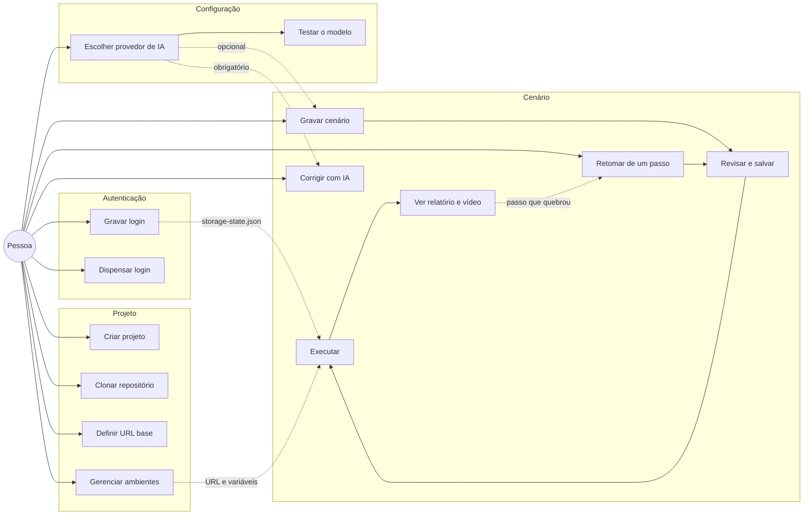
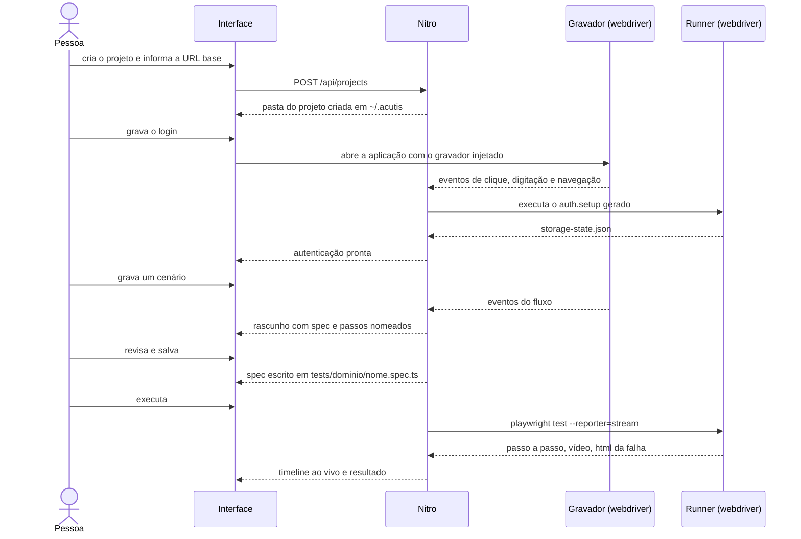
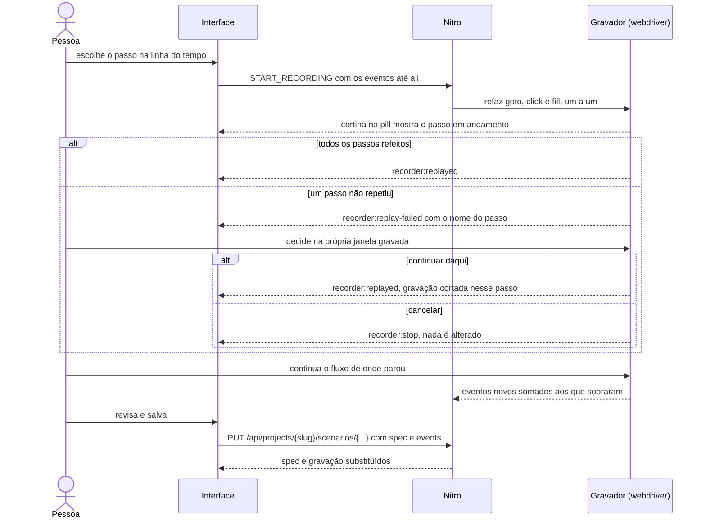
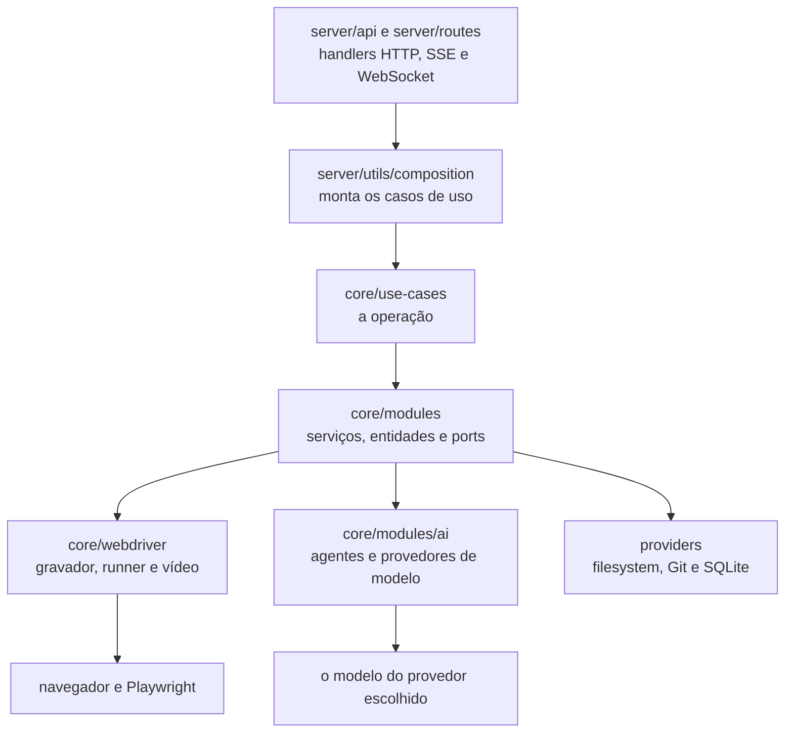

# Casos de uso

O que a aplicação faz, do ponto de vista de quem usa. Cada caso de uso é uma classe em `core/use-cases/<domínio>`, exposta por um handler em `server/api` e composta em `server/utils/composition`.

## Panorama

A IA aparece pontilhada porque é opcional: sem provedor configurado, gravar e executar seguem funcionando. O que ela acrescenta está em [Quando a IA entra](#quando-a-ia-entra).

## Do primeiro projeto ao primeiro teste verde

## Retomar a gravação de um passo

## Os casos de uso, um por um

### Projeto

| Caso de uso | Endpoint | Classe |
|-------------|----------|--------|
| Criar projeto | `POST /api/projects` | `CreateProject` |
| Clonar repositório | `POST /api/projects/clone` | `CloneProject` |
| Verificar se o repositório é público | `POST /api/projects/probe` | `GitUseCases.probe` |
| Listar e abrir projetos | `GET /api/projects`, `GET /api/projects/{slug}` | `ProjectUseCases.findAll`, `findOne` |
| Renomear, definir URL base, guardar credenciais | `PUT /api/projects/{slug}`, `PUT /api/projects/{slug}/settings` | `ProjectUseCases.update`, `setBaseUrl`, `saveCredentials` |
| Apagar projeto | `DELETE /api/projects/{slug}` | `ProjectUseCases.remove` |

A URL base pode ser dispensada (`POST /api/projects/{slug}/settings/skip`): o projeto segue utilizável, cada ambiente traz a sua.

### Ambientes

| Caso de uso | Endpoint | Classe |
|-------------|----------|--------|
| Listar, criar, editar, apagar | `/api/projects/{slug}/environments` | `EnvironmentUseCases` |
| Ativar um ambiente | `POST /api/projects/{slug}/environments/{environment}/activate` | `EnvironmentUseCases.activate` |

O ambiente ativo é o que entra na execução: URL, credenciais e variáveis chegam ao Playwright como ambiente do processo, sem tocar no spec. Os arquivos ficam versionados em `environments/`, os segredos no `.env`.

### Autenticação

| Caso de uso | Endpoint | Classe |
|-------------|----------|--------|
| Ver o estado da autenticação | `GET /api/projects/{slug}/auth` | `AuthUseCases.show` |
| Gravar o login | `POST /api/projects/{slug}/auth/record` | `AuthUseCases.record` |
| Editar o setup à mão | `PUT /api/projects/{slug}/auth` | `AuthUseCases.update` |
| Dispensar autenticação | `POST /api/projects/{slug}/auth/skip` | `AuthUseCases.skip` |

Gravar o login escreve `tests/auth.setup.ts` e roda esse setup na hora. Deu certo, a sessão vai para `storage-state.json` e os cenários seguintes partem autenticados. Cenário marcado `@publico` roda sem sessão, o que permite testar a própria tela de login.

### Cenário

| Caso de uso | Endpoint | Classe |
|-------------|----------|--------|
| Rascunhar a partir da gravação | `POST /api/projects/{slug}/tests/draft` | `GenerationUseCases.draft` |
| Salvar o rascunho revisado | `POST /api/projects/{slug}/tests` | `GenerationUseCases.write` |
| Abrir, editar, apagar | `/api/projects/{slug}/scenarios/{...}` | `ScenarioUseCases` |
| Retomar a gravação de um passo | `PUT /api/projects/{slug}/scenarios/{...}` com `events` | `ScenarioUseCases.update` |
| Executar | `POST /api/projects/{slug}/run` | `RunScenario.execute` |
| Acompanhar a execução ao vivo | `GET /api/projects/{slug}/run-stream` | `RunScenario.stream` |
| Ver o relatório HTML do Playwright | `/api/projects/{slug}/report` | `ProjectUseCases.reportFile` |

Retomar não é gravar de novo: escolhido um passo da linha do tempo, o navegador refaz sozinho os anteriores e devolve a gravação à pessoa dali para frente. Passo que não repetiu para a retomada e espera a decisão na própria janela gravada. Salvar manda os `events` junto do spec, e a gravação antiga (com o DOM que ela capturou) é substituída pela nova.

O rascunho é um passo separado de propósito: o spec e os passos chegam à tela antes de existir arquivo, e é ali que se corrige nome, domínio e tags. Salvar escreve `tests/<domínio>/<nome>.spec.ts`.

Gravar e executar são casos de uso **do cenário**, mas nenhum dos dois toca o navegador: quem faz isso é o **webdriver** (`core/webdriver`), atrás da porta `ScenarioRunner`. Ele reúne o gravador injetado na página, o runner que chama o Playwright e o recorte do vídeo. A tabela acima lista a operação; a próxima seção mostra quem a cumpre.

A execução ao vivo é um SSE: cada passo do Playwright chega como evento, e o histórico da execução fica gravado (`StoreRunHistory`) para a tela reabrir o que já rodou. Cada execução deixa vídeo, e teste vermelho deixa também o HTML da página no momento da falha.

### Configuração de IA

| Caso de uso | Endpoint | Classe |
|-------------|----------|--------|
| Ver o provedor ativo e os cadastros | `GET /api/settings/ai` | `SettingsUseCases.show` |
| Escolher provedor, chave, endereço e modelo | `PUT /api/settings/ai` | `SettingsUseCases.update` |
| Listar os modelos que o provedor oferece | `POST /api/settings/ai/models` | `SettingsUseCases.availableModels` |
| Testar o modelo antes de salvar | `POST /api/settings/ai/ping` | `SettingsUseCases.ping` |

Instalação nova nasce sem IA. Escolher "Sem IA" a qualquer momento desliga sem apagar cadastro nenhum, e a variável `AI_PROVIDER` pré-configura o provedor antes da primeira tela.

## Quando a IA entra

| Caso de uso | Endpoint | Com IA | Sem IA |
|-------------|----------|--------|--------|
| Rascunhar cenário | `POST /api/projects/{slug}/tests/draft` | Escreve o Gherkin, o título, o domínio e as tags; o spec sai com os passos nomeados | O spec sai dos eventos gravados, sem Gherkin e sem metadado |
| Corrigir cenário | `POST /api/projects/{slug}/scenario-fix` | Reescreve o spec a partir do erro da execução | Devolve vazio |
| Sugerir seletores | `POST /api/projects/{slug}/scenario-suggestions` | Propõe seletor melhor para os alvos frágeis | Devolve vazio |

Gravar, salvar, executar e ver o resultado não dependem de IA em nenhum momento.

## Onde cada coisa mora

Dois blocos concentram o mundo de fora:

| Bloco | Único lugar que | Como é alcançado |
|-------|-----------------|------------------|
| `core/webdriver` | abre navegador: gravador, runner e vídeo | pela porta `ScenarioRunner`, declarada no módulo de cenário |
| `core/modules/ai` | fala com modelo: os agentes e um adaptador por provedor | pelo provedor ativo nas configurações; sem IA, `providers/disabled.ts` responde no lugar |

Cada agente é um pedido de forma fixa ao modelo: `gherkin`, `metadata`, `selector`, `spec-fixer`, `ping`. Provedor que roda binário na máquina (Claude Agent, Codex) tem laço próprio; o resto vai pelo LangChain.

É por isso que executar e gerar aparecem como casos de uso de cenário, e não como domínios próprios: quem os cumpre é adaptador, não domínio. Trocar de provedor de IA, ou de ferramenta de navegador, não muda nenhum caso de uso desta página.
